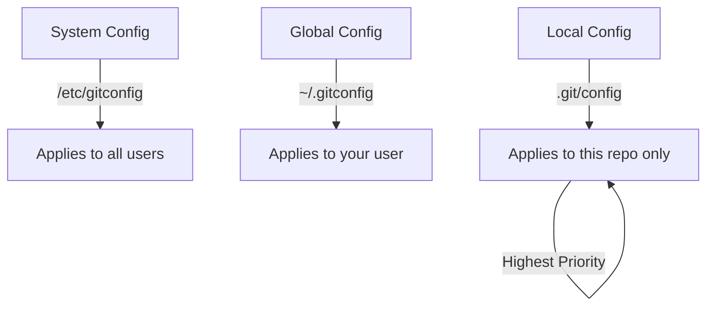

# Configuring Git

> Set up Git with your identity, preferences, and useful aliases.

---

## 👤 User Identity (Required)

### Set Your Name

```bash
git config --global user.name "Your Name"
```

> Sets your name for all commits. This appears in commit history.

---

### Set Your Email

```bash
git config --global user.email "you@example.com"
```

> Sets your email for all commits. Use the same email as your GitHub account.

---

### View Current Identity

```bash
git config user.name
```

> Shows your configured name.

```bash
git config user.email
```

> Shows your configured email.

---

## ⚙️ Configuration Levels



---

### System Level (All Users)

```bash
git config --system user.name "Name"
```

> Applies to all users on the system.

---

### Global Level (Your User)

```bash
git config --global user.name "Name"
```

> Applies to all your repositories.

---

### Local Level (This Repo)

```bash
git config --local user.name "Name"
```

> Applies only to current repository. Overrides global settings.

---

## 📋 View Configuration

### View All Settings

```bash
git config --list
```

> Shows all Git configuration settings.

---

### View Settings with Origin

```bash
git config --list --show-origin
```

> Shows settings along with which file they come from.

---

### View Specific Setting

```bash
git config user.email
```

> Shows the value of a specific setting.

---

## 🔧 Common Settings

### Set Default Branch Name

```bash
git config --global init.defaultBranch main
```

> New repositories will use `main` as default branch instead of `master`.

---

### Set Default Editor

```bash
git config --global core.editor "code --wait"
```

> Sets VS Code as the default editor for commits and rebases.

---

### Enable Auto-color

```bash
git config --global color.ui auto
```

> Enables colored output in terminal.

---

### Set Pull to Rebase

```bash
git config --global pull.rebase true
```

> `git pull` will rebase instead of merge by default.

---

### Set Push Default

```bash
git config --global push.default current
```

> Push will automatically push current branch to same-named remote branch.

---

### Enable Credential Caching

```bash
git config --global credential.helper cache
```

> Caches credentials in memory for 15 minutes.

---

### Cache Credentials Longer

```bash
git config --global credential.helper 'cache --timeout=3600'
```

> Caches credentials for 1 hour (3600 seconds).

---

## ⌨️ Useful Aliases

### Create Alias for Status

```bash
git config --global alias.st status
```

> Now you can use `git st` instead of `git status`.

---

### Create Alias for Checkout

```bash
git config --global alias.co checkout
```

> Now you can use `git co` instead of `git checkout`.

---

### Create Alias for Branch

```bash
git config --global alias.br branch
```

> Now you can use `git br` instead of `git branch`.

---

### Create Alias for Commit

```bash
git config --global alias.ci commit
```

> Now you can use `git ci` instead of `git commit`.

---

### Create Pretty Log Alias

```bash
git config --global alias.lg "log --oneline --graph --all --decorate"
```

> Now you can use `git lg` for a beautiful log view.

---

### View All Aliases

```bash
git config --get-regexp alias
```

> Shows all configured aliases.

---

## 🔐 SSH Setup

### Generate SSH Key

```bash
ssh-keygen -t ed25519 -C "you@example.com"
```

> Generates a new SSH key using Ed25519 algorithm.

---

### Start SSH Agent

```bash
eval "$(ssh-agent -s)"
```

> Starts the SSH agent in the background.

---

### Add SSH Key to Agent

```bash
ssh-add ~/.ssh/id_ed25519
```

> Adds your SSH key to the agent.

---

### Copy SSH Public Key

```bash
cat ~/.ssh/id_ed25519.pub
```

> Displays your public key. Copy this to GitHub.

---

### Test SSH Connection

```bash
ssh -T git@github.com
```

> Tests if SSH connection to GitHub works.

---

## 📊 Configuration File Example

Your `~/.gitconfig` might look like:

```ini
[user]
    name = Your Name
    email = you@example.com

[init]
    defaultBranch = main

[core]
    editor = code --wait

[alias]
    st = status
    co = checkout
    br = branch
    lg = log --oneline --graph --all --decorate

[pull]
    rebase = true
```

---

## 🔗 Related

- [[Installing_Git|Previous: Installing Git]]
- [[Git_Editor_Setup|Next: Editor Setup]]

---

#git #config #setup #aliases #ssh
