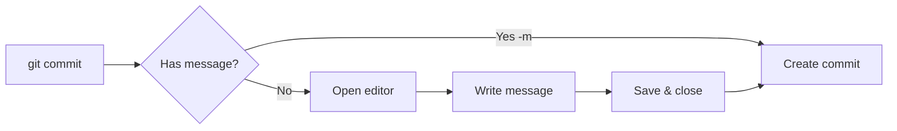

# Git Editor Setup

> Configure your preferred text editor for Git.

---

## 🔧 Set Default Editor

### VS Code

```bash
git config --global core.editor "code --wait"
```

> Sets VS Code as Git editor. `--wait` makes Git wait until file is closed.

---

### VS Code Insiders

```bash
git config --global core.editor "code-insiders --wait"
```

> Sets VS Code Insiders as Git editor.

---

### Vim

```bash
git config --global core.editor "vim"
```

> Sets Vim as Git editor.

---

### Neovim

```bash
git config --global core.editor "nvim"
```

> Sets Neovim as Git editor.

---

### Nano

```bash
git config --global core.editor "nano"
```

> Sets Nano as Git editor. Good for beginners.

---

### Sublime Text

```bash
git config --global core.editor "subl -n -w"
```

> Sets Sublime Text as Git editor.

---

### Atom

```bash
git config --global core.editor "atom --wait"
```

> Sets Atom as Git editor.

---

### Notepad++ (Windows)

```bash
git config --global core.editor "'C:/Program Files/Notepad++/notepad++.exe' -multiInst -notabbar -nosession -noPlugin"
```

> Sets Notepad++ as Git editor on Windows.

---

## 📋 Check Current Editor

```bash
git config --global core.editor
```

> Shows your currently configured editor.

---

## 🔀 Set Diff Tool

### VS Code as Diff Tool

```bash
git config --global diff.tool vscode
```

> Sets VS Code as the diff tool.

```bash
git config --global difftool.vscode.cmd 'code --wait --diff $LOCAL $REMOTE'
```

> Configures the VS Code diff command.

---

### Use Diff Tool

```bash
git difftool
```

> Opens diff in your configured diff tool.

---

### Diff Without Prompt

```bash
git difftool -y
```

> Opens diff without confirmation prompt.

---

## 🔀 Set Merge Tool

### VS Code as Merge Tool

```bash
git config --global merge.tool vscode
```

> Sets VS Code as the merge tool.

```bash
git config --global mergetool.vscode.cmd 'code --wait $MERGED'
```

> Configures the VS Code merge command.

---

### Use Merge Tool

```bash
git mergetool
```

> Opens merge conflicts in your configured merge tool.

---

### Disable Backup Files

```bash
git config --global mergetool.keepBackup false
```

> Prevents creating `.orig` backup files after merge.

---

## 📊 Editor Workflow



---

## 💻 Editor for Rebase

During interactive rebase, editor opens with:

```
pick abc1234 First commit
pick def5678 Second commit
pick ghi9012 Third commit
```

**Commands:**

- `pick` (p) - use commit
- `reword` (r) - use commit, edit message
- `edit` (e) - use commit, pause for amending
- `squash` (s) - meld into previous commit
- `drop` (d) - remove commit

---

## ⌨️ Editor Tips

### Commit Message in Editor

```
Subject line (50 chars max)

Body text wraps at 72 characters. Explain
the what and why of the change, not the how.

Footer with references:
Closes #123
```

---

## 🔗 Related

- [[Configuring_Git|Previous: Configuring Git]]
- [[../02_Basic_Git_Commands/git_add_commit|git commit]]

---

#git #editor #config #setup
