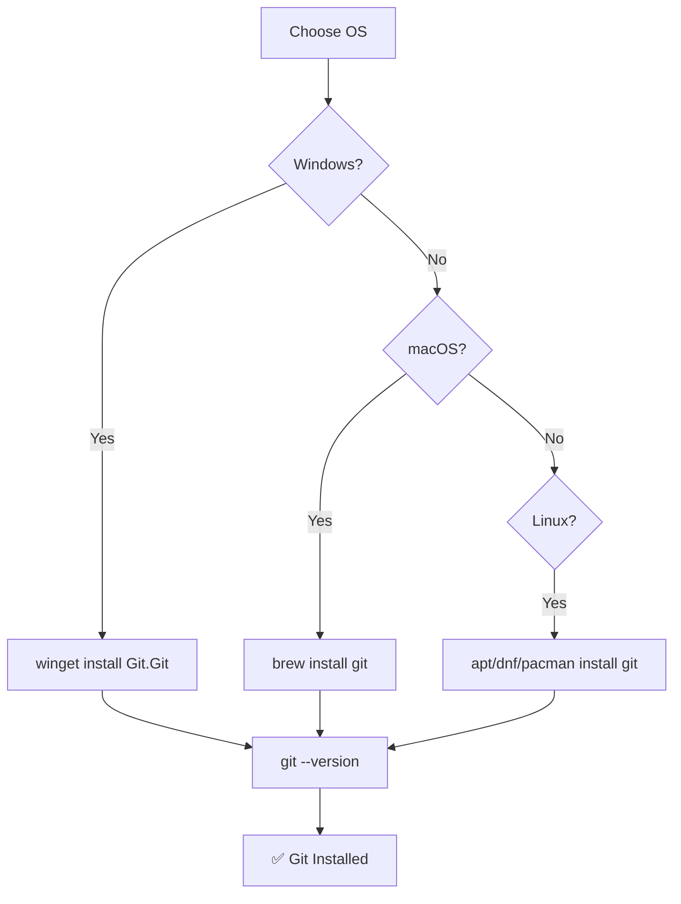

# Installing Git

> Get Git installed on any operating system.

---

## 🖥️ Windows

### Using Winget (Recommended)

```bash
winget install --id Git.Git -e --source winget
```

> Installs Git using Windows Package Manager. The `-e` flag ensures exact match.

---

### Using Chocolatey

```bash
choco install git
```

> Installs Git using Chocolatey package manager.

---

### Manual Download

Download from: https://git-scm.com/download/win

---

## 🍎 macOS

### Using Homebrew (Recommended)

```bash
brew install git
```

> Installs Git using Homebrew package manager.

---

### Using Xcode Command Line Tools

```bash
xcode-select --install
```

> Installs Git along with other developer tools from Apple.

---

### Manual Download

Download from: https://git-scm.com/download/mac

---

## 🐧 Linux

### Ubuntu / Debian

```bash
sudo apt update
```

> Updates package list.

```bash
sudo apt install git
```

> Installs Git from apt repository.

---

### Fedora

```bash
sudo dnf install git
```

> Installs Git using DNF package manager.

---

### Arch Linux

```bash
sudo pacman -S git
```

> Installs Git using Pacman package manager.

---

### CentOS / RHEL

```bash
sudo yum install git
```

> Installs Git using YUM package manager.

---

## ✅ Verify Installation

```bash
git --version
```

> Displays the installed Git version. Example output: `git version 2.43.0`

---

## 🔄 Update Git

### Windows (Winget)

```bash
winget upgrade --id Git.Git
```

> Updates Git to latest version using Winget.

---

### macOS (Homebrew)

```bash
brew upgrade git
```

> Updates Git to latest version using Homebrew.

---

### Linux (Ubuntu/Debian)

```bash
sudo apt update && sudo apt upgrade git
```

> Updates Git to latest version from apt repository.

---

## 📊 Installation Flow



---

## 🔗 Related

- [[Configuring_Git|Next: Configuring Git]]
- [[Git_Editor_Setup|Editor Setup]]

---

#git #installation #setup
