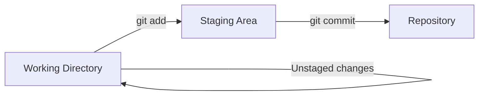
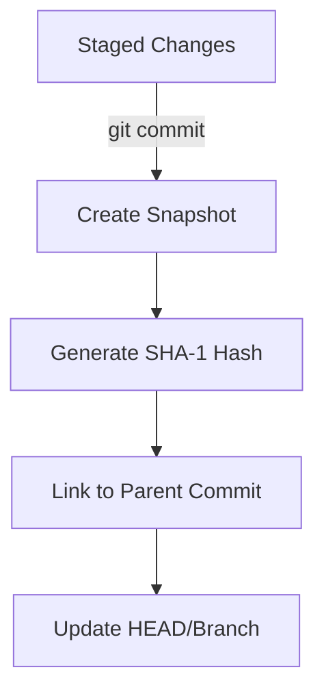

# git add & commit

> Stage changes and create commits.

---

## ➕ git add

### Stage Single File

```bash
git add filename.txt
```

> Stages `filename.txt` for the next commit.

---

### Stage Multiple Files

```bash
git add file1.txt file2.txt file3.txt
```

> Stages multiple specific files.

---

### Stage All Changes

```bash
git add .
```

> Stages all modified and new files in current directory and subdirectories.

---

### Stage All Changes (Alternative)

```bash
git add -A
```

> Stages all changes including deletions. Same as `git add --all`.

---

### Stage Only Modified Files

```bash
git add -u
```

> Stages only modified and deleted files, not new untracked files.

---

### Stage by Pattern

```bash
git add *.js
```

> Stages all JavaScript files in current directory.

---

### Stage Folder

```bash
git add src/
```

> Stages all files in the `src` folder.

---

### Interactive Staging

```bash
git add -p
```

> Opens interactive mode to stage parts of files (hunks).

Interactive options:

- `y` - stage this hunk
- `n` - skip this hunk
- `s` - split into smaller hunks
- `e` - manually edit the hunk
- `q` - quit

---

### Stage with Intent to Add

```bash
git add -N filename.txt
```

> Records that file will be added, but doesn't stage content yet.

---

## 📊 Staging Flow



---

## 📝 git commit

### Commit with Message

```bash
git commit -m "Add login feature"
```

> Creates a commit with the specified message.

---

### Commit with Multi-line Message

```bash
git commit -m "Add login feature" -m "Includes validation and error handling"
```

> Creates a commit with title and description.

---

### Commit All Modified Files

```bash
git commit -am "Fix bug in header"
```

> Stages all modified tracked files and commits. Does not include new files.

---

### Commit with Editor

```bash
git commit
```

> Opens your configured editor to write a detailed commit message.

---

### Amend Last Commit Message

```bash
git commit --amend -m "New commit message"
```

> Changes the message of the last commit.

---

### Amend Last Commit (Add Files)

```bash
git commit --amend --no-edit
```

> Adds currently staged files to the last commit without changing the message.

---

### Empty Commit

```bash
git commit --allow-empty -m "Trigger CI build"
```

> Creates a commit with no changes. Useful for triggering CI/CD.

---

### Commit with Author

```bash
git commit --author="John Doe <john@example.com>" -m "Pair programming commit"
```

> Creates commit with a different author.

---

### Signed Commit

```bash
git commit -S -m "Signed commit"
```

> Creates a GPG-signed commit.

---

## ✍️ Commit Message Format

### Conventional Commits

```
type(scope): subject

body

footer
```

**Types:**

- `feat` - New feature
- `fix` - Bug fix
- `docs` - Documentation
- `style` - Formatting
- `refactor` - Code restructure
- `test` - Tests
- `chore` - Maintenance

---

### Example Message

```
feat(auth): add password reset functionality

- Add forgot password page
- Send reset email with token
- Validate token expiration

Closes #123
```

---

## 📊 Commit Flow



---

## 💡 Tips

> [!tip] Good Commit Messages
>
> - Use imperative mood: "Add feature" not "Added feature"
> - Keep subject line under 50 characters
> - Wrap body at 72 characters

> [!tip] Atomic Commits
> Each commit should be one logical change.

---

## 🔗 Related

- [[git_status_and_diff|Next: git status & diff]]
- [[git_log_and_history|View commit history]]

---

#git #add #commit #staging #basics
