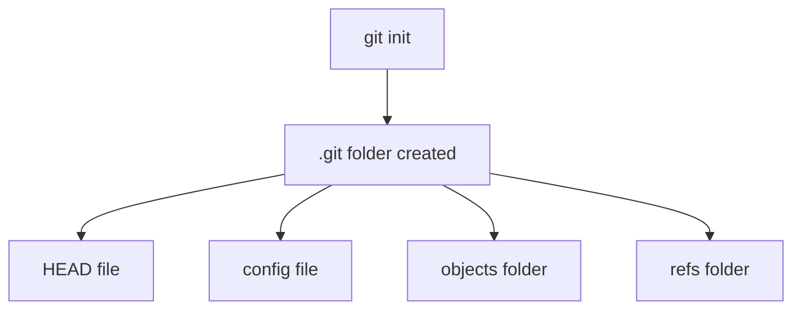

# git init and clone

> Initialize new repositories or clone existing ones.

---

## 🆕 git init

### Initialize in Current Directory

```bash
git init
```

> Creates a new Git repository in the current folder. Creates a `.git` subdirectory.

---

### Initialize in New Directory

```bash
git init project-name
```

> Creates a new folder called `project-name` and initializes a Git repository inside it.

---

### Initialize with Default Branch Name

```bash
git init -b main
```

> Initializes repository with `main` as the default branch instead of `master`.

---

### Initialize Bare Repository

```bash
git init --bare
```

> Creates a bare repository (no working directory). Used for remote/server repositories.

---

## 📊 What git init Creates



---

## 📥 git clone

### Clone from GitHub (HTTPS)

```bash
git clone https://github.com/user/repo.git
```

> Downloads the repository using HTTPS. Prompts for credentials if private.

---

### Clone from GitHub (SSH)

```bash
git clone git@github.com:user/repo.git
```

> Downloads the repository using SSH. Requires SSH key setup.

---

### Clone into Specific Folder

```bash
git clone https://github.com/user/repo.git my-folder
```

> Clones repository into a folder named `my-folder` instead of repo name.

---

### Clone into Current Directory

```bash
git clone https://github.com/user/repo.git .
```

> Clones repository contents into current directory (must be empty).

---

### Shallow Clone (Last Commit Only)

```bash
git clone --depth 1 https://github.com/user/repo.git
```

> Downloads only the latest commit. Much faster for large repos.

---

### Shallow Clone with Depth

```bash
git clone --depth 100 https://github.com/user/repo.git
```

> Downloads only the last 100 commits.

---

### Clone Single Branch

```bash
git clone --single-branch -b main https://github.com/user/repo.git
```

> Clones only the `main` branch, not all branches.

---

### Clone with Submodules

```bash
git clone --recurse-submodules https://github.com/user/repo.git
```

> Clones repository and all its submodules.

---

## 📊 Clone Flow


---

## 💡 Tips

> [!tip] Clone Private Repos
> Use SSH for easier authentication with private repositories.

> [!tip] Large Repos
> Use `--depth 1` for faster cloning of large repositories.

---

## 🔗 Related

- [[git_add_commit|Next: git add & commit]]
- [[../05_Remote_Repositories/Cloning_and_Forking|Cloning & Forking]]

---

#git #init #clone #basics
