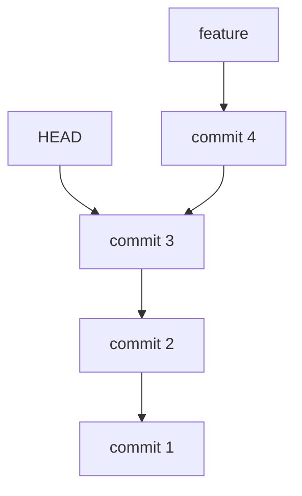

# git log & history

> View and navigate commit history.

---

## 📜 Basic Log

### Full Log

```bash
git log
```

> Shows complete commit history with full details.

---

### Compact One-line Format

```bash
git log --oneline
```

> Shows each commit on one line: short hash + message.

---

### Last N Commits

```bash
git log -5
```

> Shows only the last 5 commits.

---

### Log with Diff

```bash
git log -p
```

> Shows commit history with full diff for each commit.

---

### Log with Statistics

```bash
git log --stat
```

> Shows files changed, insertions, and deletions for each commit.

---

## 🎨 Formatting

### Graph View

```bash
git log --graph
```

> Shows ASCII graph of branch and merge history.

---

### Graph with All Branches

```bash
git log --graph --all --oneline --decorate
```

> Visual graph of all branches with decorations.

---

### Custom Format

```bash
git log --pretty=format:"%h - %an, %ar : %s"
```

> Custom format: short hash - author, relative date : subject.

---

### Format with Colors

```bash
git log --pretty=format:"%C(yellow)%h%Creset %C(blue)%an%Creset %s"
```

> Colored output: yellow hash, blue author name.

---

## 📊 Graph Visualization



---

## 🔍 Filtering

### Filter by Author

```bash
git log --author="John"
```

> Shows only commits by authors matching "John".

---

### Filter by Date Range

```bash
git log --since="2024-01-01" --until="2024-12-31"
```

> Shows commits between two dates.

---

### Filter by Relative Date

```bash
git log --since="2 weeks ago"
```

> Shows commits from the last 2 weeks.

---

### Filter by Message

```bash
git log --grep="fix"
```

> Shows commits with "fix" in the message.

---

### Filter by File

```bash
git log -- path/to/file.txt
```

> Shows only commits that touched this file.

---

### Follow File Renames

```bash
git log --follow -- path/to/file.txt
```

> Tracks file through renames.

---

### Filter by Code Change

```bash
git log -S "function_name"
```

> Shows commits that added or removed "function_name" (pickaxe search).

---

## 📋 Other History Commands

### Show Specific Commit

```bash
git show abc1234
```

> Shows details and diff of a specific commit.

---

### Show File at Commit

```bash
git show abc1234:path/to/file.txt
```

> Shows file contents at that specific commit.

---

### Who Changed Each Line

```bash
git blame filename.txt
```

> Shows who last modified each line of a file.

---

### Blame Specific Lines

```bash
git blame -L 10,20 filename.txt
```

> Shows blame for lines 10-20 only.

---

### Commits by Author Summary

```bash
git shortlog -sn
```

> Shows commit count by each author, sorted.

---

### Reference Log

```bash
git reflog
```

> Shows history of HEAD movements (even deleted commits).

---

## 🎯 Format Placeholders

| Placeholder | Meaning                |
| ----------- | ---------------------- |
| `%H`        | Full commit hash       |
| `%h`        | Short commit hash      |
| `%an`       | Author name            |
| `%ae`       | Author email           |
| `%ad`       | Author date            |
| `%ar`       | Author date (relative) |
| `%s`        | Subject (first line)   |
| `%b`        | Body                   |

---

## 💡 Tips

> [!tip] Create Log Alias
>
> ```bash
> git config --global alias.lg "log --oneline --graph --all"
> ```

> [!tip] Find Deleted File
>
> ```bash
> git log --all --full-history -- "**/filename.txt"
> ```

---

## 🔗 Related

- [[git_status_and_diff|Previous: git status & diff]]
- [[git_push_and_pull|Next: git push & pull]]
- [[../07_Git_Internals/git_detailed_history|Detailed History]]

---

#git #log #history #basics
