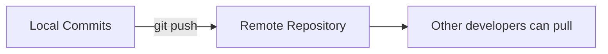
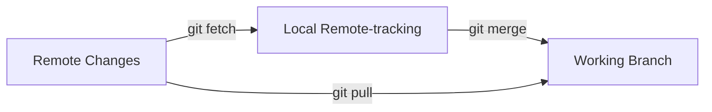

# git push & pull

> Sync your local repository with remote repositories.

---

## ⬆️ git push

### Push Current Branch

```bash
git push
```

> Pushes current branch to its tracking remote branch.

---

### Push to Specific Remote

```bash
git push origin main
```

> Pushes `main` branch to `origin` remote.

---

### Push and Set Upstream

```bash
git push -u origin feature-branch
```

> Pushes and sets upstream tracking. Future pushes just need `git push`.

---

### Push All Branches

```bash
git push --all
```

> Pushes all local branches to remote.

---

### Push Tags

```bash
git push --tags
```

> Pushes all tags to remote.

---

### Push Single Tag

```bash
git push origin v1.0.0
```

> Pushes a specific tag to remote.

---

### Force Push (Careful!)

```bash
git push --force
```

> ⚠️ Overwrites remote history. Use with caution!

---

### Safe Force Push

```bash
git push --force-with-lease
```

> Force push, but fails if someone else pushed first. Safer than `--force`.

---

### Delete Remote Branch

```bash
git push origin --delete feature-branch
```

> Deletes a branch on the remote repository.

---

## 📊 Push Flow



---

## ⬇️ git pull

### Pull Current Branch

```bash
git pull
```

> Fetches and merges changes from remote tracking branch.

---

### Pull from Specific Remote

```bash
git pull origin main
```

> Pulls `main` branch from `origin` remote.

---

### Pull with Rebase

```bash
git pull --rebase
```

> Rebases local commits on top of remote changes instead of merging.

---

### Pull Specific Branch

```bash
git pull origin feature-branch
```

> Pulls a specific branch from remote.

---

### Fetch Only (No Merge)

```bash
git fetch
```

> Downloads changes but doesn't merge them.

---

### Fetch All Remotes

```bash
git fetch --all
```

> Fetches from all configured remotes.

---

### Fetch and Prune

```bash
git fetch --prune
```

> Fetches and removes local tracking branches that no longer exist on remote.

---

## 📊 Pull Flow



---

## ⚙️ Configure Pull Behavior

### Set Pull to Always Rebase

```bash
git config --global pull.rebase true
```

> All `git pull` commands will rebase instead of merge.

---

### Set Pull to Fast-Forward Only

```bash
git config --global pull.ff only
```

> Pull will fail if fast-forward is not possible.

---

## 🔧 Handling Conflicts

### When Pull Has Conflicts

```bash
git pull
```

If conflicts occur:

```bash
# 1. Fix conflicts in files
# 2. Stage fixed files
git add .

# 3. Complete merge
git commit -m "Merge remote changes"
```

---

### Abort Pull Merge

```bash
git merge --abort
```

> Aborts the merge and returns to state before pull.

---

## 💡 Tips

> [!tip] Always Pull Before Push
>
> ```bash
> git pull --rebase && git push
> ```

> [!tip] Check What Will Be Pushed
>
> ```bash
> git log origin/main..HEAD --oneline
> ```

> [!warning] Never Force Push to Shared Branches
> Force pushing rewrites history and breaks other developers' work.

---

## 🔗 Related

- [[git_log_and_history|Previous: git log & history]]
- [[git_rm_and_mv|Next: git rm & mv]]
- [[../05_Remote_Repositories/git_fetch_vs_pull|fetch vs pull]]

---

#git #push #pull #remote #basics
