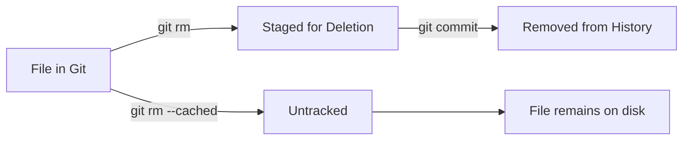

# git rm & mv

> Remove and move/rename files in Git.

---

## ❌ git rm

### Remove File from Git and Disk

```bash
git rm filename.txt
```

> Removes file from Git tracking AND deletes it from disk.

---

### Remove from Git Only (Keep File)

```bash
git rm --cached filename.txt
```

> Removes from Git but keeps the file on disk. Good for adding to `.gitignore`.

---

### Remove Multiple Files

```bash
git rm file1.txt file2.txt file3.txt
```

> Removes multiple specified files.

---

### Remove by Pattern

```bash
git rm "*.log"
```

> Removes all files matching pattern.

---

### Remove Directory

```bash
git rm -r folder/
```

> Recursively removes a directory and all its contents.

---

### Force Remove Modified File

```bash
git rm -f filename.txt
```

> Forces removal of a file that has uncommitted changes.

---

### Dry Run (Preview)

```bash
git rm --dry-run "*.log"
```

> Shows what would be removed without actually removing.

---

## 📊 rm Workflow



---

## 📁 git mv

### Rename File

```bash
git mv old-name.txt new-name.txt
```

> Renames a file and stages the change.

---

### Move File to Directory

```bash
git mv filename.txt folder/
```

> Moves file into a folder.

---

### Move and Rename

```bash
git mv old-folder/old-name.txt new-folder/new-name.txt
```

> Moves and renames in one command.

---

### Move Multiple Files

```bash
git mv file1.txt file2.txt destination-folder/
```

> Moves multiple files to a folder.

---

## 📊 mv is Shortcut

`git mv` is equivalent to:

```bash
mv old-name.txt new-name.txt
```

```bash
git rm old-name.txt
```

```bash
git add new-name.txt
```

> Git detects renames automatically even if you use regular `mv`.

---

## 🔍 Track Renames in Log

### Follow File Renames

```bash
git log --follow -- filename.txt
```

> Shows history including before file was renamed.

---

### Show Renames in Diff

```bash
git log --diff-filter=R --summary
```

> Shows only commits that have file renames.

---

## ❌ Remove Untracked Files

### Preview Cleanup

```bash
git clean -n
```

> Shows what untracked files would be deleted (dry run).

---

### Delete Untracked Files

```bash
git clean -f
```

> Deletes untracked files (requires force flag).

---

### Delete Untracked Files and Directories

```bash
git clean -fd
```

> Deletes untracked files AND directories.

---

### Delete Ignored Files Too

```bash
git clean -fdx
```

> Also removes files in `.gitignore`. ⚠️ Be careful!

---

### Interactive Cleanup

```bash
git clean -i
```

> Interactive mode to choose what to delete.

---

## 💡 Tips

> [!tip] Add Removed File to .gitignore
>
> ```bash
> git rm --cached config.local
> echo "config.local" >> .gitignore
> git add .gitignore
> git commit -m "Ignore config.local"
> ```

> [!warning] git rm --cached vs .gitignore
> Files removed with `--cached` are already in history. Use BFG or filter-repo to remove from history completely.

---

## 🔗 Related

- [[git_push_and_pull|Previous: git push & pull]]
- [[../08_Git_Advanced_Topics/git_filter_branch|Remove from History]]

---

#git #rm #mv #delete #rename
