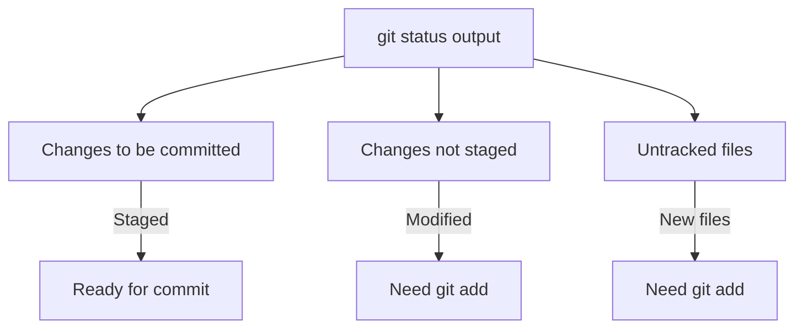
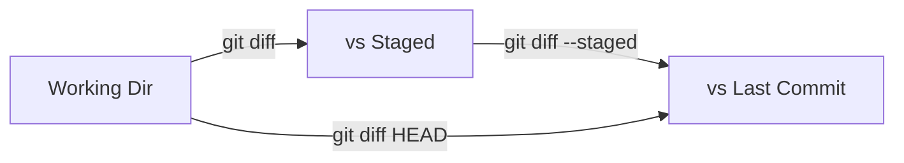

# git status & diff

> Check repository state and view changes.

---

## 📊 git status

### Full Status

```bash
git status
```

> Shows the state of working directory and staging area.

---

### Short Status

```bash
git status -s
```

> Shows compact status. First column = staging, second column = working tree.

**Symbols:**

- `M` = Modified
- `A` = Added
- `D` = Deleted
- `??` = Untracked
- `R` = Renamed

---

### Short Status with Branch

```bash
git status -sb
```

> Shows short status with branch information.

---

### Show Ignored Files

```bash
git status --ignored
```

> Also shows files that are being ignored by `.gitignore`.

---

## 📊 Status Output Meaning



---

## 🔍 git diff

### View Unstaged Changes

```bash
git diff
```

> Shows changes in working directory that are not yet staged.

---

### View Staged Changes

```bash
git diff --staged
```

> Shows changes that are staged and will go into next commit.

---

### Staged Changes (Alternative)

```bash
git diff --cached
```

> Same as `--staged`. Shows what will be committed.

---

### Diff Specific File

```bash
git diff filename.txt
```

> Shows changes only for `filename.txt`.

---

### Diff Between Commits

```bash
git diff abc1234 def5678
```

> Shows differences between two commits.

---

### Diff Between Branches

```bash
git diff main feature-branch
```

> Shows differences between two branches.

---

### Diff Current vs Branch

```bash
git diff main
```

> Shows differences between current branch and `main`.

---

### Diff HEAD vs Working Directory

```bash
git diff HEAD
```

> Shows all changes (staged and unstaged) since last commit.

---

### Show Only File Names

```bash
git diff --name-only
```

> Lists only the names of changed files.

---

### Show Names with Status

```bash
git diff --name-status
```

> Lists file names with modification type (M/A/D/R).

---

### Show Statistics

```bash
git diff --stat
```

> Shows summary of changes: files changed, insertions, deletions.

---

### Word-level Diff

```bash
git diff --word-diff
```

> Shows differences at word level instead of line level.

---

### Ignore Whitespace

```bash
git diff -w
```

> Ignores all whitespace changes.

---

### Diff with Color Words

```bash
git diff --color-words
```

> Highlights changed words in color, not entire lines.

---

## 📊 Diff Flow



---

## 💡 Tips

> [!tip] Quick Check Before Commit
> Always run `git diff --staged` before committing to review changes.

> [!tip] Save Diff to File
>
> ```bash
> git diff > changes.patch
> ```

---

## 🔗 Related

- [[git_add_commit|Previous: git add & commit]]
- [[git_log_and_history|Next: git log & history]]

---

#git #status #diff #basics
