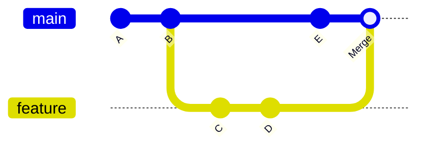
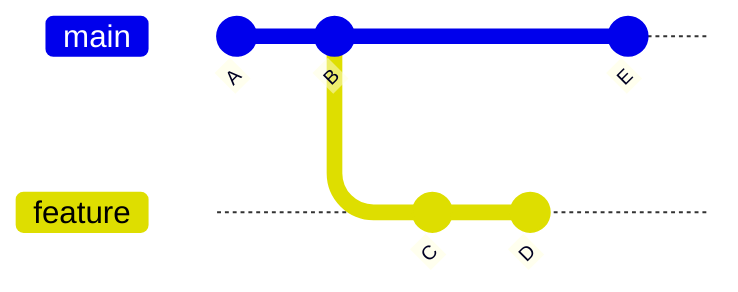
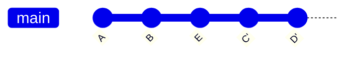

# git rebase & merge

> Combine branches using rebase or merge strategies.

---

## 🔀 git merge

### Merge Branch into Current

```bash
git merge feature-branch
```

> Merges `feature-branch` into your current branch.

---

### Merge with Commit Message

```bash
git merge feature-branch -m "Merge feature into main"
```

> Merges with a custom merge commit message.

---

### Merge with No Fast-Forward

```bash
git merge --no-ff feature-branch
```

> Creates a merge commit even if fast-forward is possible. Preserves branch history.

---

### Fast-Forward Only

```bash
git merge --ff-only feature-branch
```

> Only merges if fast-forward is possible. Fails otherwise.

---

### Squash Merge

```bash
git merge --squash feature-branch
```

> Takes all commits from branch and squashes into one staged change. Need to commit after.

---

### Abort Merge

```bash
git merge --abort
```

> Cancels the merge and returns to pre-merge state.

---

## 📊 Merge Flow



---

## 🔄 git rebase

### Rebase Current onto Branch

```bash
git rebase main
```

> Replays current branch's commits on top of `main`.

---

### Interactive Rebase

```bash
git rebase -i HEAD~3
```

> Opens editor to modify last 3 commits.

**Options in editor:**

- `pick` - use commit
- `reword` - edit commit message
- `edit` - pause for amending
- `squash` - combine with previous
- `drop` - remove commit

---

### Rebase onto Specific Commit

```bash
git rebase --onto main feature~3 feature
```

> Rebases last 3 commits of `feature` onto `main`.

---

### Continue After Fix

```bash
git rebase --continue
```

> Continues rebase after resolving conflicts.

---

### Skip Current Commit

```bash
git rebase --skip
```

> Skips the current conflicting commit.

---

### Abort Rebase

```bash
git rebase --abort
```

> Cancels rebase and returns to original state.

---

### Autosquash Fixup Commits

```bash
git rebase -i --autosquash HEAD~5
```

> Auto-orders `fixup!` and `squash!` commits.

---

## 📊 Rebase Flow



After `git rebase main`:



---

## 📋 Merge vs Rebase Comparison

| Aspect    | Merge              | Rebase              |
| --------- | ------------------ | ------------------- |
| History   | Preserves parallel | Linear              |
| Commits   | Adds merge commit  | Rewrites commits    |
| Conflicts | Once               | Per-commit          |
| Safety    | Safe               | ⚠️ Rewrites history |
| Use case  | Shared branches    | Feature branches    |

---

## ⚠️ Golden Rule

> [!warning] Never Rebase Public Branches
> Don't rebase commits that have been pushed to shared branches.

---

## 💡 Tips

> [!tip] Pull with Rebase
>
> ```bash
> git pull --rebase origin main
> ```

> [!tip] Configure Default
>
> ```bash
> git config --global pull.rebase true
> ```

---

## 🔗 Related

- [[git_reset_and_checkout|Next: git reset & checkout]]
- [[../04_Branching_and_Merging/git_rebase_vs_merge|Rebase vs Merge]]
- [[../04_Branching_and_Merging/Merging_and_Resolving_Conflicts|Resolving Conflicts]]

---

#git #rebase #merge #advanced
