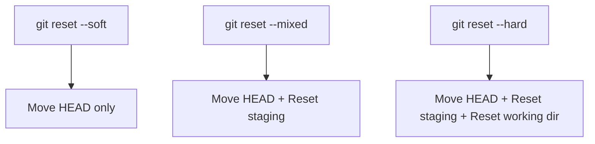

# git reset & checkout

> Undo changes and navigate commits.

---

## 🔄 git reset

### Soft Reset (Keep Changes Staged)

```bash
git reset --soft HEAD~1
```

> Undoes last commit but keeps changes staged. Ready to re-commit.

---

### Mixed Reset (Keep Changes Unstaged)

```bash
git reset HEAD~1
```

> Undoes last commit, unstages changes, but keeps them in working directory.

---

### Hard Reset (Discard Everything)

```bash
git reset --hard HEAD~1
```

> ⚠️ Undoes last commit AND discards all changes. Cannot be recovered easily.

---

### Reset to Specific Commit

```bash
git reset --hard abc1234
```

> Resets to specific commit. All subsequent commits are removed.

---

### Reset to Remote Branch

```bash
git reset --hard origin/main
```

> Makes local branch identical to remote.

---

### Unstage File (Keep Changes)

```bash
git reset HEAD filename.txt
```

> Removes file from staging area but keeps changes in working directory.

---

### Unstage All Files

```bash
git reset HEAD
```

> Unstages all files while keeping changes.

---

## 📊 Reset Modes Comparison

| Mode      | HEAD     | Index     | Working Dir |
| --------- | -------- | --------- | ----------- |
| `--soft`  | ✅ Moves | Unchanged | Unchanged   |
| `--mixed` | ✅ Moves | ✅ Reset  | Unchanged   |
| `--hard`  | ✅ Moves | ✅ Reset  | ✅ Reset    |

---

## 📊 Reset Flow



---

## ↩️ git checkout (Legacy for Files)

### Discard Changes in File

```bash
git checkout -- filename.txt
```

> Discards uncommitted changes in file. Restores from last commit.

---

### Checkout File from Commit

```bash
git checkout abc1234 -- filename.txt
```

> Restores file to state at specific commit.

---

### Checkout File from Branch

```bash
git checkout main -- filename.txt
```

> Gets file from `main` branch into current branch.

---

## ↩️ git restore (Modern)

### Discard Working Directory Changes

```bash
git restore filename.txt
```

> Modern alternative to `checkout --`. Discards uncommitted changes.

---

### Discard All Changes

```bash
git restore .
```

> Discards all uncommitted changes in current directory.

---

### Unstage File

```bash
git restore --staged filename.txt
```

> Modern way to unstage a file.

---

### Restore from Commit

```bash
git restore --source=abc1234 filename.txt
```

> Restores file from specific commit.

---

### Restore from HEAD~2

```bash
git restore --source=HEAD~2 filename.txt
```

> Restores file from 2 commits ago.

---

## 🔀 git switch (Modern for Branches)

### Switch Branch

```bash
git switch branch-name
```

> Modern alternative to `checkout` for switching branches.

---

### Create and Switch

```bash
git switch -c new-branch
```

> Creates new branch and switches to it.

---

### Switch to Previous Branch

```bash
git switch -
```

> Switches to the previous branch you were on.

---

## 🚨 Recovery After Hard Reset

### View Lost Commits

```bash
git reflog
```

> Shows history of where HEAD was. Find lost commit hash.

---

### Recover Lost Commit

```bash
git reset --hard abc1234
```

> Reset to the commit hash found in reflog.

---

## 💡 Tips

> [!warning] Hard Reset is Dangerous
> `git reset --hard` discards work permanently. Use `git stash` first if unsure.

> [!tip] Modern Commands
> Use `git restore` for files and `git switch` for branches.

---

## 🔗 Related

- [[git_rebase_and_merge|Previous: git rebase & merge]]
- [[git_stash|Next: git stash]]
- [[../08_Git_Advanced_Topics/git_reflog|git reflog]]

---

#git #reset #checkout #restore #undo #advanced
