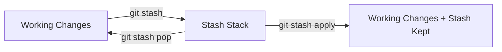

# git stash

> Temporarily save uncommitted changes.

---

## 💾 Basic Stashing

### Stash Current Changes

```bash
git stash
```

> Saves all uncommitted changes and reverts to clean working directory.

---

### Stash with Message

```bash
git stash push -m "Work in progress on login"
```

> Stashes changes with a descriptive message.

---

### Stash Including Untracked

```bash
git stash -u
```

> Stashes changes including untracked (new) files.

---

### Stash Everything

```bash
git stash -a
```

> Stashes all files including untracked and ignored files.

---

### Stash Specific Files

```bash
git stash push path/to/file.txt path/to/other.txt
```

> Stashes only the specified files.

---

### Stash with Keeping Staged

```bash
git stash --keep-index
```

> Stashes only unstaged changes. Staged changes remain staged.

---

## 📋 View Stash List

### List All Stashes

```bash
git stash list
```

> Shows all stashed changes. Example output:
> `stash@{0}: WIP on main: abc1234 Commit message`

---

### Show Stash Contents

```bash
git stash show
```

> Shows summary of most recent stash.

---

### Show Stash Diff

```bash
git stash show -p
```

> Shows full diff of most recent stash.

---

### Show Specific Stash

```bash
git stash show stash@{2}
```

> Shows summary of specific stash.

---

## 📊 Stash Flow



---

## ↩️ Restore Stash

### Apply and Remove Stash

```bash
git stash pop
```

> Applies most recent stash and removes it from stash list.

---

### Apply and Keep Stash

```bash
git stash apply
```

> Applies most recent stash but keeps it in stash list.

---

### Apply Specific Stash

```bash
git stash apply stash@{2}
```

> Applies a specific stash from the list.

---

### Pop Specific Stash

```bash
git stash pop stash@{2}
```

> Pops a specific stash.

---

## 🗑️ Delete Stash

### Drop Most Recent Stash

```bash
git stash drop
```

> Removes most recent stash without applying.

---

### Drop Specific Stash

```bash
git stash drop stash@{2}
```

> Removes a specific stash.

---

### Clear All Stashes

```bash
git stash clear
```

> ⚠️ Removes all stashes. Cannot be undone!

---

## 🌿 Stash and Branch

### Create Branch from Stash

```bash
git stash branch new-branch-name
```

> Creates new branch from where stash was made and applies stash.

---

### Create Branch from Specific Stash

```bash
git stash branch new-branch stash@{2}
```

> Creates branch and applies specific stash.

---

## 💡 Tips

> [!tip] Quick Stash and Pull
>
> ```bash
> git stash
> git pull
> git stash pop
> ```

> [!tip] Stash Before Switching Branches
> If you have uncommitted changes, stash before switching.

> [!warning] Stash Conflicts
> If `pop` causes conflicts, the stash is NOT dropped. Use `git stash drop` after resolving.

---

## 🔗 Related

- [[git_reset_and_checkout|Previous: git reset & checkout]]
- [[git_submodules|Next: git submodules]]
- [[../04_Branching_and_Merging/Creating_and_Checking_Out_Branches|Branching]]

---

#git #stash #temporary #advanced
