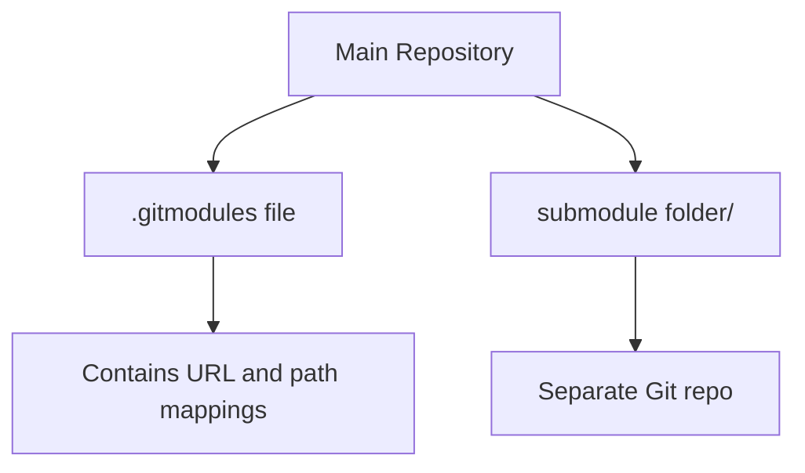

# git submodules

> Include other repositories within your repository.

---

## ➕ Adding Submodules

### Add a Submodule

```bash
git submodule add https://github.com/user/repo.git
```

> Adds repository as submodule in current directory.

---

### Add to Specific Path

```bash
git submodule add https://github.com/user/repo.git libs/repo-name
```

> Adds submodule at specified path.

---

### Add Specific Branch

```bash
git submodule add -b develop https://github.com/user/repo.git
```

> Adds submodule tracking the `develop` branch.

---

## 📊 Submodule Structure



---

## 📥 Cloning with Submodules

### Clone with All Submodules

```bash
git clone --recurse-submodules https://github.com/user/repo.git
```

> Clones repository and all submodules in one command.

---

### Initialize After Clone

```bash
git submodule init
```

> Initializes submodule configuration.

---

### Update Submodules After Clone

```bash
git submodule update
```

> Fetches submodule content at recorded commit.

---

### Init and Update Together

```bash
git submodule update --init
```

> Initializes and updates all submodules.

---

### Include Nested Submodules

```bash
git submodule update --init --recursive
```

> Initializes and updates submodules including nested ones.

---

## 🔄 Updating Submodules

### Update to Latest Commit

```bash
git submodule update --remote
```

> Updates submodule to latest commit on tracked branch.

---

### Update Specific Submodule

```bash
git submodule update --remote submodule-name
```

> Updates only the specified submodule.

---

### Pull Within Submodule

```bash
cd submodule-folder
git pull origin main
cd ..
git add submodule-folder
git commit -m "Update submodule to latest"
```

> Manual way to update submodule.

---

## 📋 View Submodule Status

### List Submodules

```bash
git submodule status
```

> Shows current commit of each submodule.

---

### Detailed Status

```bash
git submodule status --recursive
```

> Shows status including nested submodules.

---

### View .gitmodules

```bash
cat .gitmodules
```

> Shows submodule configuration file.

---

## 🗑️ Removing Submodules

### Step 1: Deinitialize

```bash
git submodule deinit submodule-name
```

> Removes submodule from working tree.

---

### Step 2: Remove from Git

```bash
git rm submodule-name
```

> Removes submodule folder and .gitmodules entry.

---

### Step 3: Clean Cache (Optional)

```bash
rm -rf .git/modules/submodule-name
```

> Removes cached submodule data.

---

### Commit the Removal

```bash
git commit -m "Remove submodule"
```

> Commits the submodule removal.

---

## ⚙️ Configuration

### Set Submodule Branch

```bash
git config -f .gitmodules submodule.name.branch develop
```

> Sets which branch the submodule should track.

---

### Shallow Submodules

```bash
git config -f .gitmodules submodule.name.shallow true
```

> Makes submodule clone shallow (less disk space).

---

## 🔄 Common Workflow

### After Pulling Main Repo

```bash
git submodule update --init --recursive
```

> Ensures submodules are at correct commits after pull.

---

### Configure Auto-update

```bash
git config --global submodule.recurse true
```

> Automatically updates submodules on git pull.

---

## 💡 Tips

> [!tip] Foreach Command
>
> ```bash
> git submodule foreach 'git pull origin main'
> ```
>
> Runs command in each submodule.

> [!warning] Submodule Commits
> After updating submodule, you must commit the change to main repo.

---

## 🔗 Related

- [[git_stash|Previous: git stash]]
- [[git_tagging|Next: git tagging]]

---

#git #submodule #advanced
