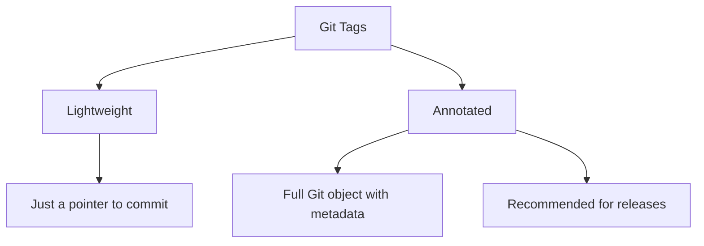

# git tagging

> Create and manage version tags.

---

## 🏷️ Creating Tags

### Lightweight Tag

```bash
git tag v1.0.0
```

> Creates simple tag pointing to current commit.

---

### Annotated Tag (Recommended)

```bash
git tag -a v1.0.0 -m "Release version 1.0.0"
```

> Creates tag with message, author, and date information.

---

### Tag Specific Commit

```bash
git tag -a v1.0.0 abc1234 -m "Release version 1.0.0"
```

> Creates tag on a specific commit hash.

---

### Signed Tag

```bash
git tag -s v1.0.0 -m "Signed release"
```

> Creates GPG-signed tag.

---

## 📋 View Tags

### List All Tags

```bash
git tag
```

> Shows all tags in repository.

---

### List Tags with Pattern

```bash
git tag -l "v1.*"
```

> Lists tags matching pattern.

---

### Show Tag Details

```bash
git show v1.0.0
```

> Shows tag information and associated commit.

---

### List Tags with Messages

```bash
git tag -n
```

> Lists tags with first line of message.

---

### List with Full Messages

```bash
git tag -n99
```

> Lists tags with up to 99 lines of message.

---

## 📊 Tag Types



---

## ⬆️ Sharing Tags

### Push Single Tag

```bash
git push origin v1.0.0
```

> Pushes specific tag to remote.

---

### Push All Tags

```bash
git push origin --tags
```

> Pushes all local tags to remote.

---

### Push Only Annotated Tags

```bash
git push origin --follow-tags
```

> Pushes commits and annotated tags only.

---

## ✅ Checkout Tags

### Checkout Tag (Detached HEAD)

```bash
git checkout v1.0.0
```

> Switches to tag. Warning: detached HEAD state.

---

### Create Branch from Tag

```bash
git checkout -b release-1.0 v1.0.0
```

> Creates new branch starting from tag.

---

## 🗑️ Deleting Tags

### Delete Local Tag

```bash
git tag -d v1.0.0
```

> Removes tag from local repository.

---

### Delete Remote Tag

```bash
git push origin --delete v1.0.0
```

> Removes tag from remote repository.

---

### Alternative Remote Delete

```bash
git push origin :refs/tags/v1.0.0
```

> Alternative syntax to delete remote tag.

---

## 🔄 Fetch Remote Tags

### Fetch All Tags

```bash
git fetch --tags
```

> Downloads all tags from remote.

---

### Fetch and Prune Tags

```bash
git fetch --prune --prune-tags
```

> Fetches and removes locally deleted remote tags.

---

## ✍️ Semantic Versioning

Format: `MAJOR.MINOR.PATCH`

| Change | Version | When                                |
| ------ | ------- | ----------------------------------- |
| Major  | v2.0.0  | Breaking changes                    |
| Minor  | v1.1.0  | New features (backwards compatible) |
| Patch  | v1.0.1  | Bug fixes                           |

---

### Pre-release Tags

```bash
git tag -a v2.0.0-beta.1 -m "Beta release"
```

> Creates pre-release version tag.

---

### Release Candidate

```bash
git tag -a v2.0.0-rc.1 -m "Release candidate 1"
```

> Creates release candidate tag.

---

## 💡 Tips

> [!tip] Find Tag for Commit
>
> ```bash
> git tag --contains abc1234
> ```

> [!tip] Latest Tag
>
> ```bash
> git describe --tags --abbrev=0
> ```

> [!tip] Describe Current Position
>
> ```bash
> git describe --tags
> ```
>
> Shows: `v1.0.0-5-gabc1234` (5 commits after v1.0.0)

---

## 🔗 Related

- [[git_submodules|Previous: git submodules]]
- [[../06_Git_Workflows/Git_Flow|Git Flow (uses tags)]]

---

#git #tag #version #release #advanced
