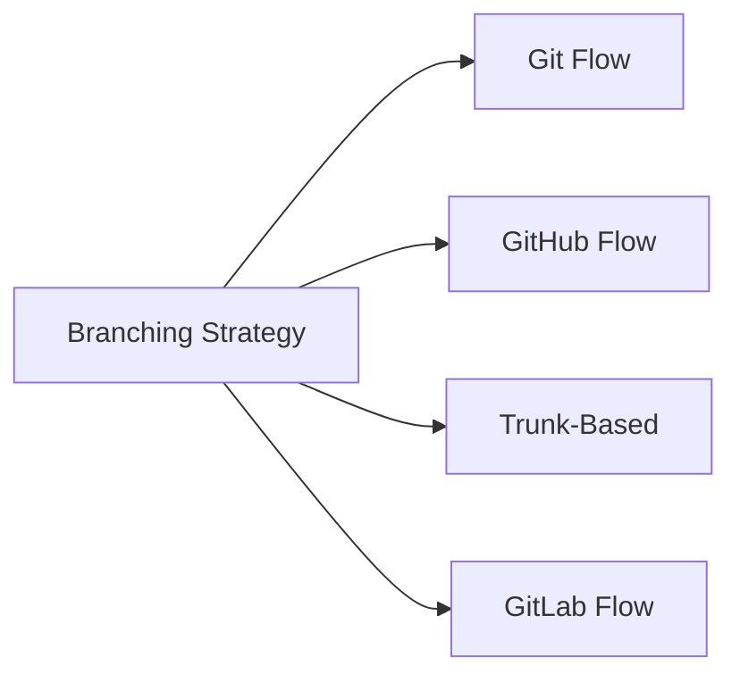

# Branching Strategies

> Popular branching models for different team sizes.

---

## 🌳 Overview



---

## 🔵 Git Flow

Best for: **Scheduled releases, larger teams**

### Branches

| Branch      | Purpose             |
| ----------- | ------------------- |
| `main`      | Production releases |
| `develop`   | Integration branch  |
| `feature/*` | New features        |
| `release/*` | Release preparation |
| `hotfix/*`  | Production fixes    |

### Start Feature Branch

```bash
git checkout develop
```

> First, switch to develop branch.

```bash
git pull origin develop
```

> Get latest changes.

```bash
git checkout -b feature/user-auth
```

> Create feature branch from develop.

---

### Finish Feature Branch

```bash
git checkout develop
```

> Switch to develop.

```bash
git merge --no-ff feature/user-auth
```

> Merge feature with no fast-forward.

```bash
git branch -d feature/user-auth
```

> Delete feature branch.

---

## 🟢 GitHub Flow

Best for: **Continuous delivery, smaller teams**

### Branches

| Branch      | Purpose           |
| ----------- | ----------------- |
| `main`      | Always deployable |
| `feature-*` | Any change        |

### Create Feature Branch

```bash
git checkout main
```

> Switch to main.

```bash
git pull origin main
```

> Get latest.

```bash
git checkout -b feature-add-login
```

> Create feature branch.

---

### Work and Push

```bash
git add .
```

> Stage changes.

```bash
git commit -m "Add login feature"
```

> Commit work.

```bash
git push -u origin feature-add-login
```

> Push branch.

---

### Create Pull Request

```bash
gh pr create --fill
```

> Create PR using GitHub CLI.

---

### After Merge

```bash
git checkout main
```

> Switch to main.

```bash
git pull origin main
```

> Get merged changes.

```bash
git branch -d feature-add-login
```

> Delete local branch.

---

## 🟡 Trunk-Based Development

Best for: **High-velocity teams, continuous integration**

### Branches

| Branch               | Purpose         |
| -------------------- | --------------- |
| `main` (trunk)       | All development |
| Short-lived branches | < 1 day         |

### Short-Lived Branch

```bash
git checkout -b quick-fix
```

> Create short-lived branch.

```bash
git commit -am "Quick fix"
```

> Make changes.

```bash
git checkout main && git merge quick-fix
```

> Merge quickly.

---

### Direct to Main

```bash
git checkout main
```

> Work directly on main.

```bash
git pull --rebase
```

> Rebase before pushing.

```bash
git push
```

> Push directly.

---

## 📊 Strategy Comparison

| Aspect          | Git Flow  | GitHub Flow  | Trunk-Based |
| --------------- | --------- | ------------ | ----------- |
| Complexity      | High      | Low          | Low         |
| Release cycle   | Scheduled | Continuous   | Continuous  |
| Team size       | Large     | Small-Medium | Any         |
| Branch lifetime | Long      | Short        | Very short  |

---

## 💡 Choosing a Strategy

> [!tip] Start Simple
> Use GitHub Flow unless you have specific needs for Git Flow.

> [!tip] CI/CD
> Trunk-based works best with strong CI/CD and feature flags.

---

## 🔗 Related

- [[Creating_and_Checking_Out_Branches|Creating Branches]]
- [[Merging_and_Resolving_Conflicts|Merging]]
- [[../06_Git_Workflows/Git_Flow|Git Flow Details]]
- [[../06_Git_Workflows/GitHub_Flow|GitHub Flow Details]]

---

#git #branching #strategy #workflow
