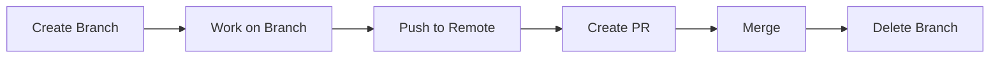

# Creating and Checking Out Branches

> Create, switch, and manage Git branches.

---

## 🌿 Creating Branches

### Create Branch

```bash
git branch feature-login
```

> Creates new branch but stays on current branch.

---

### Create and Switch

```bash
git checkout -b feature-login
```

> Creates new branch and switches to it.

---

### Modern: Create and Switch

```bash
git switch -c feature-login
```

> Modern command to create and switch.

---

### Create from Specific Commit

```bash
git branch feature-login abc1234
```

> Creates branch starting from specific commit.

---

### Create from Another Branch

```bash
git branch feature-login main
```

> Creates branch from `main` branch.

---

### Create from Tag

```bash
git checkout -b hotfix-1.0.1 v1.0.0
```

> Creates branch from a tag.

---

## 🔀 Switching Branches

### Switch Branch

```bash
git checkout main
```

> Switches to `main` branch.

---

### Modern: Switch Branch

```bash
git switch main
```

> Modern way to switch branches.

---

### Switch to Previous Branch

```bash
git checkout -
```

> Switches to the branch you were previously on.

---

### Modern: Previous Branch

```bash
git switch -
```

> Modern way to switch to previous branch.

---

### Force Switch (Discard Changes)

```bash
git checkout -f main
```

> ⚠️ Switches and discards uncommitted changes.

---

## 📋 Viewing Branches

### List Local Branches

```bash
git branch
```

> Shows all local branches. Current branch marked with \*.

---

### List with Last Commit

```bash
git branch -v
```

> Shows branches with last commit info.

---

### List All Branches (Including Remote)

```bash
git branch -a
```

> Shows local and remote-tracking branches.

---

### List Remote Branches Only

```bash
git branch -r
```

> Shows only remote-tracking branches.

---

### List Merged Branches

```bash
git branch --merged
```

> Shows branches merged into current branch.

---

### List Unmerged Branches

```bash
git branch --no-merged
```

> Shows branches not yet merged.

---

## 📊 Branch Lifecycle



---

## ✏️ Renaming Branches

### Rename Current Branch

```bash
git branch -m new-name
```

> Renames the current branch.

---

### Rename Specific Branch

```bash
git branch -m old-name new-name
```

> Renames a branch while on different branch.

---

### Rename on Remote

```bash
git push origin --delete old-name
```

> Delete old branch on remote.

```bash
git push -u origin new-name
```

> Push renamed branch.

---

## 🗑️ Deleting Branches

### Delete Local Branch

```bash
git branch -d feature-login
```

> Deletes branch only if merged.

---

### Force Delete Local Branch

```bash
git branch -D feature-login
```

> ⚠️ Force deletes even if unmerged.

---

### Delete Remote Branch

```bash
git push origin --delete feature-login
```

> Deletes branch on remote.

---

### Prune Deleted Remote Branches

```bash
git fetch --prune
```

> Removes local tracking branches for deleted remotes.

---

## 🧹 Cleanup

### Delete All Merged Branches

```bash
git branch --merged main | grep -v main | xargs git branch -d
```

> Deletes all branches merged into main.

---

## 💡 Tips

> [!tip] Check Current Branch
>
> ```bash
> git branch --show-current
> ```

> [!tip] Show Branch Graph
>
> ```bash
> git log --oneline --graph --all
> ```

---

## 🔗 Related

- [[Branching_Strategies|Branching Strategies]]
- [[Merging_and_Resolving_Conflicts|Merging]]
- [[../03_Advanced_Git_Commands/git_stash|Stash before switching]]

---

#git #branch #switch #checkout
