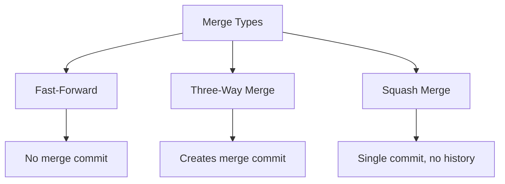

# Merging and Resolving Conflicts

> Combine branches and handle conflicts.

---

## 🔀 Basic Merging

### Merge Branch into Current

```bash
git merge feature-branch
```

> Merges `feature-branch` into current branch.

---

### Merge with Commit Message

```bash
git merge feature-branch -m "Merge feature into main"
```

> Merges with custom message.

---

### No Fast-Forward Merge

```bash
git merge --no-ff feature-branch
```

> Always creates merge commit, even if fast-forward possible.

---

### Fast-Forward Only

```bash
git merge --ff-only feature-branch
```

> Only merges if fast-forward possible. Fails otherwise.

---

## 📊 Merge Types



---

## 🔀 Fast-Forward Merge

When branch is directly ahead:

```
Before:
main:    A---B
              \
feature:       C---D

After git merge feature:
main:    A---B---C---D
```

---

## 🔀 Three-Way Merge

When branches have diverged:

```
Before:
main:    A---B---E
              \
feature:       C---D

After git merge feature:
main:    A---B---E---M
              \     /
feature:       C---D
```

---

## ⚠️ Handling Conflicts

### Check for Conflicts

```bash
git status
```

> Shows files with conflicts marked as "both modified".

---

### View Conflict Markers

Conflict in file looks like:

```
<<<<<<< HEAD
Your changes here
=======
Their changes here
>>>>>>> feature-branch
```

---

### Steps to Resolve

1. **Open conflicted file**
2. **Find conflict markers** (`<<<<<<<`, `=======`, `>>>>>>>`)
3. **Choose/combine changes**
4. **Remove conflict markers**
5. **Stage and commit**

---

### Stage Resolved File

```bash
git add resolved-file.txt
```

> Marks file as resolved.

---

### Complete Merge

```bash
git commit
```

> Completes the merge (editor opens for message).

---

### With Message

```bash
git commit -m "Resolve merge conflicts"
```

> Completes merge with inline message.

---

## ❌ Abort Merge

### Cancel and Return to Pre-merge State

```bash
git merge --abort
```

> Aborts merge and returns to state before merge started.

---

## 🔧 Merge Tools

### Open Merge Tool

```bash
git mergetool
```

> Opens configured merge tool for conflict resolution.

---

### Configure Merge Tool (VS Code)

```bash
git config --global merge.tool vscode
```

> Sets VS Code as merge tool.

```bash
git config --global mergetool.vscode.cmd 'code --wait $MERGED'
```

> Configures the command.

---

### Skip Backup Files

```bash
git config --global mergetool.keepBackup false
```

> Prevents creation of `.orig` backup files.

---

## 🔀 Squash Merge

### Squash All Commits

```bash
git merge --squash feature-branch
```

> Brings all changes but doesn't commit. All commits squashed into one.

---

### Commit Squashed Changes

```bash
git commit -m "Add feature (squashed)"
```

> Commits the squashed changes.

---

## 📋 View Merge Commits

### Show Merge Commits

```bash
git log --merges
```

> Shows only merge commits.

---

### Show Non-Merge Commits

```bash
git log --no-merges
```

> Shows only non-merge commits.

---

## 💡 Tips

> [!tip] Preview Merge
>
> ```bash
> git merge --no-commit --no-ff feature-branch
> git diff --cached
> git merge --abort
> ```

> [!tip] Check What Would Conflict
>
> ```bash
> git merge --no-commit feature-branch
> ```

> [!warning] Never Merge Unfinished Work
> Always ensure your branch is in good state before merging.

---

## 🔗 Related

- [[Creating_and_Checking_Out_Branches|Branches]]
- [[git_rebase_vs_merge|Rebase vs Merge]]
- [[../03_Advanced_Git_Commands/git_rebase_and_merge|Advanced Merging]]

---

#git #merge #conflict #resolution
