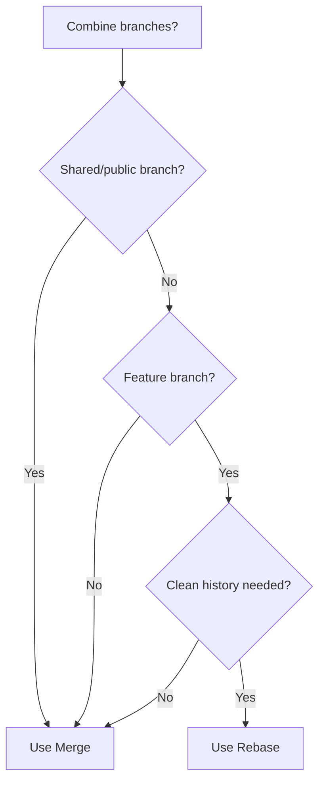

# git rebase vs merge

> When to use rebase and when to use merge.

---

## 📊 Visual Comparison

### Before

```
main:    A---B---C
              \
feature:       D---E
```

---

### After Merge

```bash
git checkout main
git merge feature
```

```
main:    A---B---C-------M
              \         /
feature:       D---E----
```

> Creates merge commit `M` preserving both histories.

---

### After Rebase

```bash
git checkout feature
git rebase main
```

```
main:    A---B---C
                  \
feature:           D'---E'
```

> Replays commits on top of main with new hashes.

---

## 📋 Comparison Table

| Aspect    | Merge                         | Rebase                 |
| --------- | ----------------------------- | ---------------------- |
| History   | Non-linear, preserves context | Linear, clean          |
| Commits   | Original hashes kept          | New hashes created     |
| Conflicts | Resolve once                  | Resolve per commit     |
| Safety    | Safe for shared branches      | ⚠️ Don't use on shared |
| Use case  | Shared branches, releases     | Feature branches       |

---

## ✅ When to Use Merge

### Merge Main into Feature

```bash
git checkout feature-branch
```

> Switch to feature.

```bash
git merge main
```

> Merge main into feature to get latest changes.

---

### Merge Feature into Main

```bash
git checkout main
```

> Switch to main.

```bash
git merge feature-branch
```

> Merge completed feature.

---

### Merge for Public/Shared Branches

```bash
git merge --no-ff feature-branch
```

> Always use merge for branches others are using.

---

## ✅ When to Use Rebase

### Rebase Feature onto Main

```bash
git checkout feature-branch
```

> Switch to feature.

```bash
git rebase main
```

> Rebase your commits onto latest main.

---

### Pull with Rebase

```bash
git pull --rebase origin main
```

> Fetches and rebases instead of merging.

---

### Configure Always Rebase on Pull

```bash
git config --global pull.rebase true
```

> Makes `git pull` always rebase.

---

### Interactive Rebase for Cleanup

```bash
git rebase -i HEAD~3
```

> Clean up last 3 commits before merging.

---

## 📊 Decision Flowchart



---

## ⚠️ Golden Rules

### Never Rebase Public Branches

```bash
# ❌ DON'T DO THIS
git checkout main
git rebase feature
```

> Never rebase main or shared branches.

---

### Safe to Rebase Private Branches

```bash
# ✅ SAFE
git checkout my-feature
git rebase main
```

> Rebase your own feature branch onto main.

---

## 🔄 Recommended Workflow

### 1. Work on Feature Branch

```bash
git checkout -b feature/new-thing
```

> Create feature branch.

---

### 2. Regularly Rebase onto Main

```bash
git fetch origin
```

> Get latest from remote.

```bash
git rebase origin/main
```

> Rebase onto latest main.

---

### 3. Before PR, Clean Up

```bash
git rebase -i HEAD~5
```

> Squash/reword commits.

---

### 4. Create PR

```bash
gh pr create
```

> Submit pull request.

---

### 5. Merge with Squash (GitHub)

On GitHub, use "Squash and merge" for clean history.

---

## 💡 Tips

> [!tip] Rebase After Pick
> Always rebase feature onto main before creating PR.

> [!warning] Force Push After Rebase
> After rebasing a pushed branch:
>
> ```bash
> git push --force-with-lease
> ```

> [!tip] Prefer Merge for Beginners
> Merge is safer and easier to understand.

---

## 🔗 Related

- [[Merging_and_Resolving_Conflicts|Merging]]
- [[../03_Advanced_Git_Commands/git_rebase_and_merge|Rebase Details]]
- [[Branching_Strategies|Strategies]]

---

#git #rebase #merge #comparison #workflow
