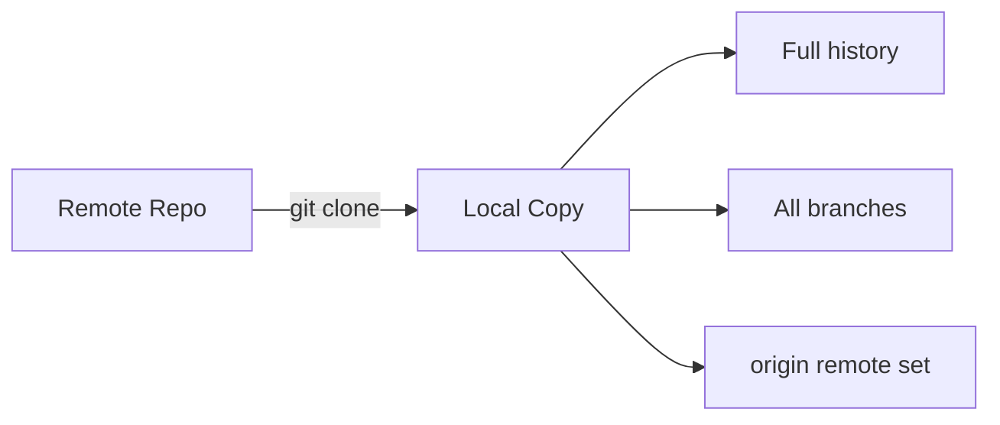
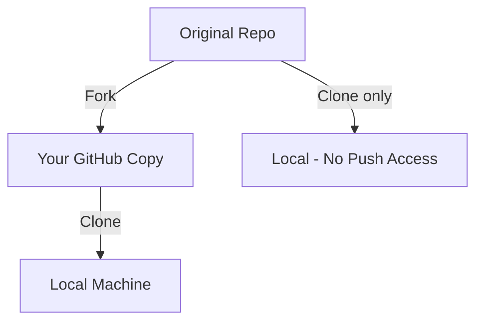

# Cloning and Forking

> Download repositories and create your own copies.

---

## 📥 git clone

### Clone Repository (HTTPS)

```bash
git clone https://github.com/user/repo.git
```

> Downloads repository using HTTPS. Prompts for credentials if private.

---

### Clone Repository (SSH)

```bash
git clone git@github.com:user/repo.git
```

> Downloads repository using SSH. Requires SSH key setup.

---

### Clone to Specific Folder

```bash
git clone https://github.com/user/repo.git my-project
```

> Clones into folder named `my-project`.

---

### Shallow Clone

```bash
git clone --depth 1 https://github.com/user/repo.git
```

> Downloads only latest commit. Fast for large repos.

---

### Clone Single Branch

```bash
git clone --single-branch -b main https://github.com/user/repo.git
```

> Clones only the specified branch.

---

### Clone with Submodules

```bash
git clone --recurse-submodules https://github.com/user/repo.git
```

> Clones repository including all submodules.

---

## 📊 Clone Flow



---

## 🍴 Forking

### Fork via GitHub CLI

```bash
gh repo fork user/repo
```

> Creates a fork on your GitHub account.

---

### Fork and Clone

```bash
gh repo fork user/repo --clone
```

> Forks and clones to local machine.

---

### Fork to Organization

```bash
gh repo fork user/repo --org my-org
```

> Forks to an organization instead of personal account.

---

## 📊 Fork vs Clone



| Action       | Result                                   |
| ------------ | ---------------------------------------- |
| Clone        | Local copy, push to original (if access) |
| Fork         | GitHub copy under your account           |
| Fork + Clone | Full control, can contribute via PR      |

---

## 🔄 Working with Fork

### Clone Your Fork

```bash
git clone git@github.com:YOUR-USERNAME/repo.git
```

> Clone your fork to local machine.

---

### Add Upstream Remote

```bash
git remote add upstream https://github.com/ORIGINAL-OWNER/repo.git
```

> Adds original repo as "upstream" remote.

---

### View Remotes

```bash
git remote -v
```

> Shows all configured remotes.

---

### Fetch Upstream Changes

```bash
git fetch upstream
```

> Downloads changes from original repo.

---

### Merge Upstream Changes

```bash
git checkout main
```

> Switch to main.

```bash
git merge upstream/main
```

> Merge original repo's changes.

---

### Sync Fork (GitHub CLI)

```bash
gh repo sync owner/fork --source upstream/repo
```

> Syncs your fork with upstream.

---

## 💡 Tips

> [!tip] Keep Fork Updated
> Regularly sync with upstream to avoid large conflicts.

> [!tip] Contribute Back
> Make changes in feature branch, push to fork, create PR to upstream.

---

## 🔗 Related

- [[Connecting_to_Remote_Repo|Remote Setup]]
- [[../06_Git_Workflows/Forking_Workflow|Forking Workflow]]

---

#git #clone #fork #remote
