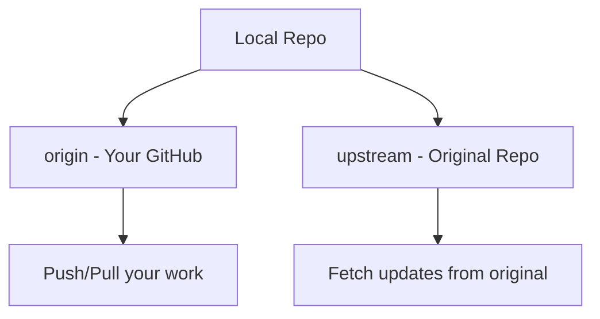

# Connecting to Remote Repo

> Set up and manage remote repositories.

---

## ➕ Adding Remotes

### Add Origin Remote

```bash
git remote add origin https://github.com/user/repo.git
```

> Adds remote named "origin" with HTTPS URL.

---

### Add Origin with SSH

```bash
git remote add origin git@github.com:user/repo.git
```

> Adds remote with SSH URL (recommended).

---

### Add Upstream Remote

```bash
git remote add upstream https://github.com/original-owner/repo.git
```

> Adds original repo as upstream (for forks).

---

### Add Multiple Remotes

```bash
git remote add gitlab git@gitlab.com:user/repo.git
```

> You can have multiple remotes with different names.

---

## 📋 Viewing Remotes

### List Remotes

```bash
git remote
```

> Shows names of configured remotes.

---

### List with URLs

```bash
git remote -v
```

> Shows remotes with fetch and push URLs.

---

### Show Remote Details

```bash
git remote show origin
```

> Shows detailed info about the remote.

---

## 📊 Remote Structure



---

## ✏️ Modifying Remotes

### Change Remote URL

```bash
git remote set-url origin git@github.com:user/new-repo.git
```

> Changes URL of existing remote.

---

### Change from HTTPS to SSH

```bash
git remote set-url origin git@github.com:user/repo.git
```

> Switches from HTTPS to SSH URL.

---

### Rename Remote

```bash
git remote rename origin upstream
```

> Renames remote from "origin" to "upstream".

---

### Remove Remote

```bash
git remote remove upstream
```

> Removes a remote completely.

---

## 🔄 Syncing with Remotes

### Fetch All Remotes

```bash
git fetch --all
```

> Downloads from all configured remotes.

---

### Fetch Specific Remote

```bash
git fetch origin
```

> Downloads only from origin.

---

### Prune Deleted Branches

```bash
git remote prune origin
```

> Removes local tracking branches for deleted remote branches.

---

### Fetch and Prune

```bash
git fetch --prune
```

> Fetches and removes stale tracking branches.

---

## 🔐 Authentication

### Test SSH Connection

```bash
ssh -T git@github.com
```

> Tests if SSH authentication to GitHub works.

---

### Cache HTTPS Credentials

```bash
git config --global credential.helper cache
```

> Caches credentials for 15 minutes.

---

### Store Credentials

```bash
git config --global credential.helper store
```

> Stores credentials in plain text file (less secure).

---

### Use macOS Keychain

```bash
git config --global credential.helper osxkeychain
```

> Stores credentials in macOS Keychain.

---

## 💡 Tips

> [!tip] Use SSH for Convenience
> SSH keys don't require password entry on each push.

> [!tip] Multiple Remotes
> Use `origin` for your repo, `upstream` for source repo.

---

## 🔗 Related

- [[Cloning_and_Forking|Cloning]]
- [[git_push_to_remotes|Pushing]]
- [[git_fetch_vs_pull|Fetch vs Pull]]

---

#git #remote #origin #upstream
