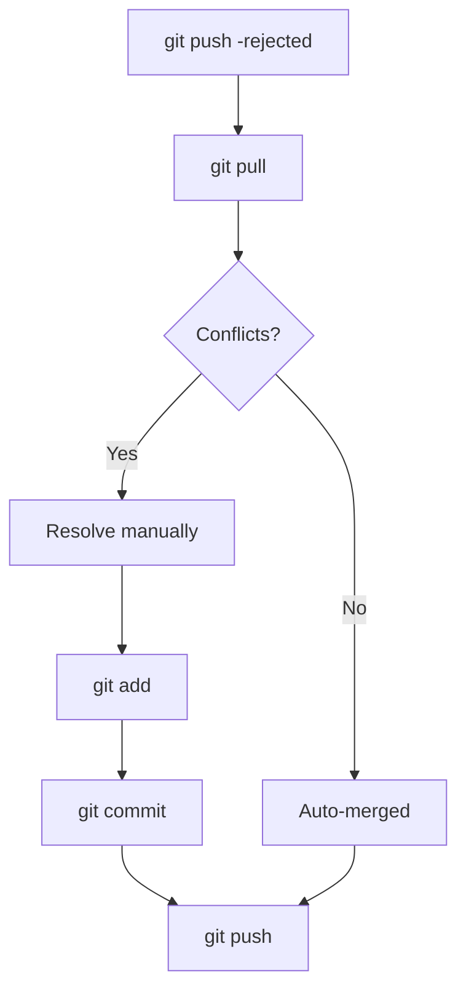

# Handling Remote Conflicts

> Resolve conflicts when syncing with remote.

---

## ⚠️ When Conflicts Occur

Conflicts happen when:

- You and someone else edited the same lines
- You pushed and remote has newer commits
- Merging branches with overlapping changes

---

## 📊 Conflict Flow



---

## 🔄 Pull Conflicts

### Pull and Hit Conflict

```bash
git pull origin main
```

> If conflicts exist, Git stops and marks files.

---

### Check Conflict Status

```bash
git status
```

> Shows files with "both modified" status.

---

### View Conflict Markers

Conflicted file contains:

```
<<<<<<< HEAD
Your local changes
=======
Remote changes
>>>>>>> origin/main
```

---

### Resolve Conflict

1. Open file
2. Remove `<<<<<<<`, `=======`, `>>>>>>>`
3. Keep desired code

---

### Stage Resolved File

```bash
git add conflicted-file.txt
```

> Marks conflict as resolved.

---

### Complete Merge

```bash
git commit -m "Resolve merge conflict"
```

> Finishes the merge.

---

### Push Resolved Changes

```bash
git push origin main
```

> Pushes your resolved merge.

---

## 🔄 Push Rejected

### Rejected Push

```bash
git push origin main
# ERROR: rejected - remote contains work you don't have
```

> Remote has commits you don't have locally.

---

### Solution: Pull and Merge

```bash
git pull origin main
```

> Fetches and merges remote changes.

---

### Solution: Pull with Rebase

```bash
git pull --rebase origin main
```

> Rebases your changes on top of remote (cleaner history).

---

### Then Push

```bash
git push origin main
```

> Now push should succeed.

---

## ⚠️ Force Push (Danger!)

### Force Push

```bash
git push --force origin main
```

> ⚠️ DANGEROUS: Overwrites remote history. Only use if you know what you're doing.

---

### Safer Force Push

```bash
git push --force-with-lease origin main
```

> Fails if someone else pushed. Safer than `--force`.

---

## 🔄 Abort Operations

### Abort Merge

```bash
git merge --abort
```

> Cancels merge and returns to pre-merge state.

---

### Abort Rebase

```bash
git rebase --abort
```

> Cancels rebase and returns to original state.

---

### Abort Pull

If pull started merge:

```bash
git merge --abort
```

> Returns to state before pull.

---

## 🔧 Using Merge Tool

### Open Merge Tool

```bash
git mergetool
```

> Opens configured merge tool for visual conflict resolution.

---

### Configure VS Code

```bash
git config --global merge.tool vscode
```

> Sets VS Code as merge tool.

---

## 💡 Tips

> [!tip] Avoid Conflicts
>
> - Pull frequently
> - Make smaller commits
> - Communicate with team

> [!tip] Rebase vs Merge
> Use `--rebase` for cleaner history when pulling.

> [!warning] Never Force Push to Shared Branches
> This breaks other developers' work.

---

## 🔗 Related

- [[git_fetch_vs_pull|Fetch vs Pull]]
- [[../04_Branching_and_Merging/Merging_and_Resolving_Conflicts|Merge Conflicts]]

---

#git #conflict #remote #merge
