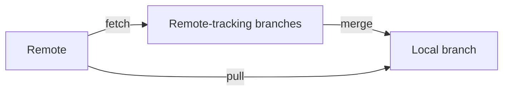

# git fetch vs pull

> Understand the difference between fetch and pull.

---

## 📊 Comparison



| Command | Action           |
| ------- | ---------------- |
| `fetch` | Download only    |
| `pull`  | Download + merge |

---

## 📥 git fetch

### Fetch from Origin

```bash
git fetch origin
```

> Downloads commits, files, and refs from remote. Does NOT change working files.

---

### Fetch All Remotes

```bash
git fetch --all
```

> Fetches from all configured remotes.

---

### Fetch Specific Branch

```bash
git fetch origin feature-branch
```

> Fetches only the specified branch.

---

### Fetch with Prune

```bash
git fetch --prune
```

> Fetches and removes stale remote-tracking branches.

---

### Fetch Tags

```bash
git fetch --tags
```

> Downloads all tags from remote.

---

## After Fetch

### See What Changed

```bash
git log HEAD..origin/main
```

> Shows commits on remote that you don't have.

---

### Compare Changes

```bash
git diff HEAD origin/main
```

> Shows diff between your HEAD and remote.

---

### Merge After Fetch

```bash
git merge origin/main
```

> Merges fetched changes into current branch.

---

### Rebase After Fetch

```bash
git rebase origin/main
```

> Rebases your commits onto fetched changes.

---

## 📥 git pull

### Pull from Tracking Branch

```bash
git pull
```

> Fetches and merges from upstream tracking branch.

---

### Pull from Specific Remote

```bash
git pull origin main
```

> Fetches and merges `main` from `origin`.

---

### Pull with Rebase

```bash
git pull --rebase
```

> Fetches and rebases instead of merging (cleaner history).

---

### Pull Specific Branch

```bash
git pull origin feature-branch
```

> Pulls specific branch from remote.

---

### Pull with Auto-stash

```bash
git pull --autostash
```

> Stashes changes before pull, reapplies after.

---

## ⚙️ Configure Pull Behavior

### Always Rebase on Pull

```bash
git config --global pull.rebase true
```

> Makes `git pull` always rebase.

---

### Fast-Forward Only

```bash
git config --global pull.ff only
```

> Pull fails if fast-forward not possible.

---

### Merge on Pull (Default)

```bash
git config --global pull.rebase false
```

> Uses merge (default behavior).

---

## 📊 When to Use Which

| Scenario            | Use                      |
| ------------------- | ------------------------ |
| See what's new      | `fetch`                  |
| Review before merge | `fetch` then `log/diff`  |
| Quick sync          | `pull`                   |
| Clean history       | `pull --rebase`          |
| CI/CD scripts       | `fetch` + explicit merge |

---

## 💡 Tips

> [!tip] Fetch is Safe
> Fetch never changes your working files. Use it to preview.

> [!tip] Pull = Fetch + Merge
> `git pull` is literally `git fetch` followed by `git merge`.

> [!tip] Prefer Rebase for Feature Branches
>
> ```bash
> git pull --rebase origin main
> ```

---

## 🔗 Related

- [[git_push_to_remotes|Pushing]]
- [[Handling_Remote_Conflicts|Conflicts]]
- [[../02_Basic_Git_Commands/git_push_and_pull|Push & Pull]]

---

#git #fetch #pull #remote #sync
