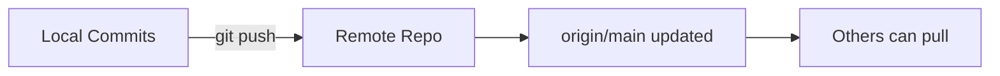

# git push to remotes

> Push changes to remote repositories.

---

## ⬆️ Basic Push

### Push Current Branch

```bash
git push
```

> Pushes to upstream tracking branch.

---

### Push to Specific Remote

```bash
git push origin main
```

> Pushes `main` to `origin` remote.

---

### Push and Set Upstream

```bash
git push -u origin feature-branch
```

> Pushes and sets upstream. Future pushes only need `git push`.

---

## 🔀 Push Options

### Push All Branches

```bash
git push --all origin
```

> Pushes all local branches to origin.

---

### Push Tags

```bash
git push --tags
```

> Pushes all tags to remote.

---

### Push Single Tag

```bash
git push origin v1.0.0
```

> Pushes specific tag.

---

### Push with Follow Tags

```bash
git push --follow-tags
```

> Pushes commits and any related annotated tags.

---

## 📊 Push Flow



---

## ⚠️ Force Push

### Force Push

```bash
git push --force origin main
```

> ⚠️ DANGEROUS: Overwrites remote history completely.

---

### Safe Force with Lease

```bash
git push --force-with-lease
```

> Force pushes but fails if someone else pushed first. Much safer.

---

### Force Push Specific Branch

```bash
git push --force-with-lease origin feature-branch
```

> Force push only your feature branch.

---

## 🗑️ Delete Remote Branch

### Delete Remote Branch

```bash
git push origin --delete feature-branch
```

> Removes branch from remote.

---

### Alternative Syntax

```bash
git push origin :feature-branch
```

> Alternative way to delete remote branch.

---

## ⚙️ Configure Push

### Set Default Push Behavior

```bash
git config --global push.default current
```

> Push current branch to same-named remote branch.

---

### Push Behavior Options

| Option     | Behavior                   |
| ---------- | -------------------------- |
| `current`  | Push current to same name  |
| `simple`   | Push to upstream (default) |
| `matching` | Push all matching branches |
| `nothing`  | Must specify explicitly    |

---

## 🔍 Check Before Push

### What Will Be Pushed

```bash
git log origin/main..HEAD --oneline
```

> Shows commits that will be pushed.

---

### Dry Run

```bash
git push --dry-run origin main
```

> Shows what would be pushed without pushing.

---

## 🔄 Push to Multiple Remotes

### Add URL to Existing Remote

```bash
git remote set-url --add origin git@gitlab.com:user/repo.git
```

> Adds second URL. Push goes to both.

---

### Push to Specific Remote

```bash
git push github main
```

> Pushes to remote named "github".

```bash
git push gitlab main
```

> Pushes to remote named "gitlab".

---

## 💡 Tips

> [!tip] Always Pull Before Push
> Avoids push rejection due to remote changes.

> [!warning] Never Force Push to Shared Branches
> This rewrites history and breaks others' work.

> [!tip] Use `-u` First Time
>
> ```bash
> git push -u origin branch
> ```
>
> Then future pushes just need `git push`.

---

## 🔗 Related

- [[git_fetch_vs_pull|Fetch vs Pull]]
- [[Handling_Remote_Conflicts|Conflicts]]
- [[Connecting_to_Remote_Repo|Remote Setup]]

---

#git #push #remote #upload
