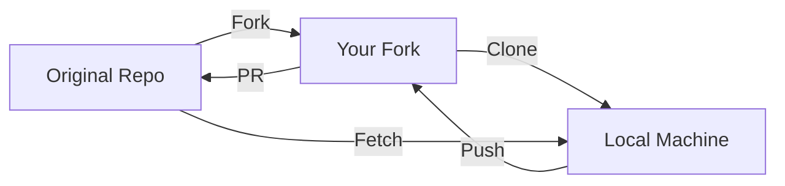
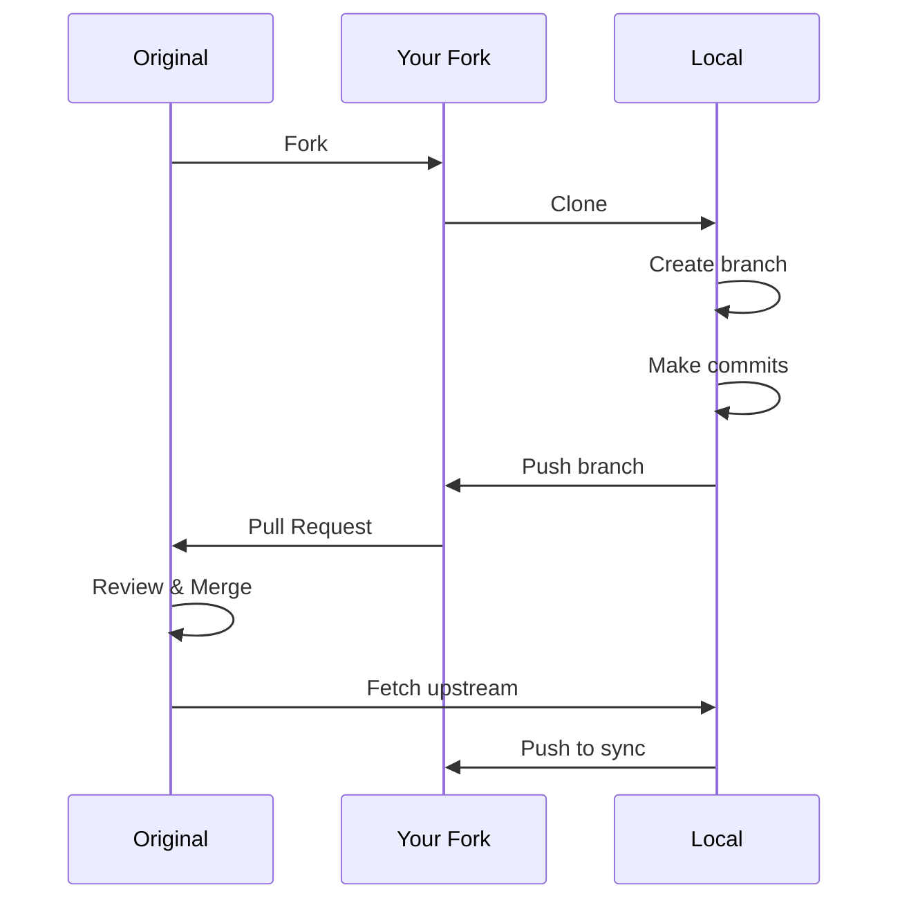

# Forking Workflow

> Contribute to projects you don't have write access to.

---

## 📊 Workflow Overview



---

## 1️⃣ Fork the Repository

### Fork via GitHub CLI

```bash
gh repo fork original-owner/repo
```

> Creates fork on your GitHub account.

---

### Fork and Clone

```bash
gh repo fork original-owner/repo --clone
```

> Forks and clones in one command.

---

## 2️⃣ Clone Your Fork

### Clone Your Fork

```bash
git clone git@github.com:YOUR-USERNAME/repo.git
```

> Downloads your fork locally.

---

### Navigate to Folder

```bash
cd repo
```

> Enter the cloned directory.

---

## 3️⃣ Add Upstream Remote

### Add Upstream

```bash
git remote add upstream https://github.com/original-owner/repo.git
```

> Links to original repository.

---

### Verify Remotes

```bash
git remote -v
```

> Should show `origin` (your fork) and `upstream` (original).

---

## 4️⃣ Keep Fork Updated

### Fetch Upstream

```bash
git fetch upstream
```

> Downloads changes from original repo.

---

### Merge Upstream into Main

```bash
git checkout main
```

> Switch to main.

```bash
git merge upstream/main
```

> Merge original repo's changes.

---

### Push Updates to Fork

```bash
git push origin main
```

> Update your fork on GitHub.

---

## 5️⃣ Create Feature Branch

### Create Branch

```bash
git checkout -b feature/add-new-thing
```

> Create branch for your work.

---

### Make Changes

Edit files, then:

```bash
git add .
```

> Stage changes.

```bash
git commit -m "Add new feature"
```

> Commit with message.

---

### Push Branch to Fork

```bash
git push -u origin feature/add-new-thing
```

> Push to your fork.

---

## 6️⃣ Create Pull Request

### Create PR via CLI

```bash
gh pr create --repo original-owner/repo
```

> Creates PR to original repository.

---

### Create PR with Details

```bash
gh pr create --title "Add feature" --body "Description" --repo original-owner/repo
```

> Creates PR with title and description.

---

## 📊 Complete Flow



---

## 💡 Tips

> [!tip] Keep Main Clean
> Never commit directly to main. Always use feature branches.

> [!tip] Sync Before PR
>
> ```bash
> git fetch upstream
> git rebase upstream/main
> ```

---

## 🔗 Related

- [[../05_Remote_Repositories/Cloning_and_Forking|Cloning & Forking]]
- [[Pull_Requests|Pull Requests]]
- [[GitHub_Flow|GitHub Flow]]

---

#git #fork #workflow #contribution
