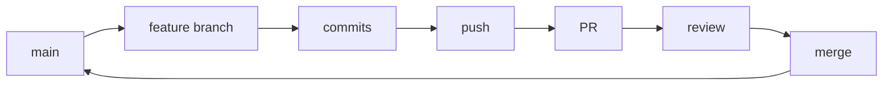

# GitHub Flow

> Simple workflow for continuous delivery.

---

## 📊 Overview



---

## 📋 Rules

1. `main` is always deployable
2. Branch from main for any work
3. Commit and push regularly
4. Open PR when ready for review
5. Merge after approval
6. Deploy from main

---

## 1️⃣ Update Main

### Switch to Main

```bash
git checkout main
```

> Switch to main branch.

---

### Pull Latest

```bash
git pull origin main
```

> Get latest changes.

---

## 2️⃣ Create Feature Branch

### Create and Switch

```bash
git checkout -b feature/user-authentication
```

> Create branch for your feature.

---

### For Bug Fix

```bash
git checkout -b fix/login-error
```

> Create branch for bug fix.

---

## 3️⃣ Work and Commit

### Stage Changes

```bash
git add .
```

> Stage all changes.

---

### Commit with Message

```bash
git commit -m "feat: add login form validation"
```

> Commit with descriptive message.

---

### Push Branch

```bash
git push -u origin feature/user-authentication
```

> Push branch to remote.

---

## 4️⃣ Create Pull Request

### Create PR

```bash
gh pr create
```

> Interactive PR creation.

---

### Create PR with Details

```bash
gh pr create --title "Add user authentication" --body "Implements login and registration"
```

> Creates PR with title and description.

---

### Create Draft PR

```bash
gh pr create --draft
```

> Creates draft PR for early feedback.

---

## 5️⃣ Review and Merge

### View PR Status

```bash
gh pr status
```

> Shows status of your PRs.

---

### Merge via CLI

```bash
gh pr merge --squash
```

> Squash and merge the PR.

---

### Merge Options

```bash
gh pr merge --merge
```

> Creates merge commit.

```bash
gh pr merge --rebase
```

> Rebases commits.

---

## 6️⃣ Cleanup

### Switch to Main

```bash
git checkout main
```

> Go back to main.

---

### Pull Merged Changes

```bash
git pull origin main
```

> Get the merged changes.

---

### Delete Local Branch

```bash
git branch -d feature/user-authentication
```

> Remove local branch.

---

### Delete Remote Branch

```bash
git push origin --delete feature/user-authentication
```

> Remove remote branch (if not auto-deleted).

---

## 📊 Branch Naming

| Type    | Format                | Example                 |
| ------- | --------------------- | ----------------------- |
| Feature | `feature/description` | `feature/user-auth`     |
| Bug fix | `fix/description`     | `fix/login-error`       |
| Hotfix  | `hotfix/description`  | `hotfix/security-patch` |
| Docs    | `docs/description`    | `docs/api-readme`       |

---

## 💡 Tips

> [!tip] Small PRs
> Keep PRs small and focused. Easier to review and merge.

> [!tip] CI Checks
> Set up required status checks on main branch.

---

## 🔗 Related

- [[Git_Flow|Git Flow]]
- [[Pull_Requests|Pull Requests]]
- [[Forking_Workflow|Forking Workflow]]

---

#git #github #flow #workflow
