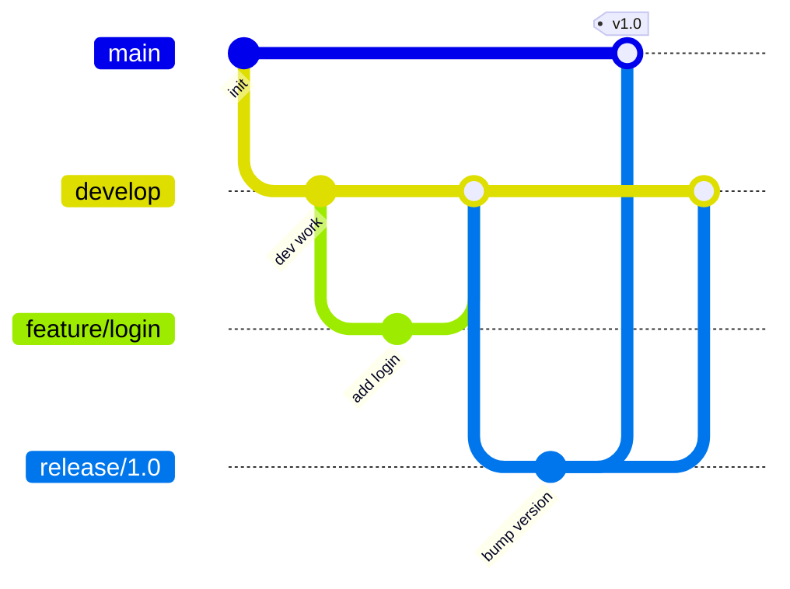

# Git Flow

> Structured workflow for scheduled releases.

---

## 📊 Branch Structure



---

## 📋 Branch Types

| Branch      | Purpose          | Branches from | Merges to     |
| ----------- | ---------------- | ------------- | ------------- |
| `main`      | Production       | -             | -             |
| `develop`   | Integration      | main          | -             |
| `feature/*` | New features     | develop       | develop       |
| `release/*` | Release prep     | develop       | main, develop |
| `hotfix/*`  | Production fixes | main          | main, develop |

---

## 🚀 Feature Branch

### Start Feature

```bash
git checkout develop
```

> Switch to develop.

```bash
git pull origin develop
```

> Get latest.

```bash
git checkout -b feature/user-login
```

> Create feature branch.

---

### Work on Feature

```bash
git add .
```

> Stage changes.

```bash
git commit -m "feat: add login form"
```

> Commit work.

---

### Finish Feature

```bash
git checkout develop
```

> Switch to develop.

```bash
git merge --no-ff feature/user-login
```

> Merge with merge commit.

```bash
git branch -d feature/user-login
```

> Delete feature branch.

```bash
git push origin develop
```

> Push develop.

---

## 📦 Release Branch

### Start Release

```bash
git checkout develop
```

> Switch to develop.

```bash
git checkout -b release/1.0.0
```

> Create release branch.

---

### Prepare Release

```bash
git commit -m "Bump version to 1.0.0"
```

> Update version numbers.

---

### Finish Release

```bash
git checkout main
```

> Switch to main.

```bash
git merge --no-ff release/1.0.0
```

> Merge to main.

```bash
git tag -a v1.0.0 -m "Release 1.0.0"
```

> Tag the release.

```bash
git checkout develop
```

> Switch to develop.

```bash
git merge --no-ff release/1.0.0
```

> Merge back to develop.

```bash
git branch -d release/1.0.0
```

> Delete release branch.

---

### Push Everything

```bash
git push origin main
```

> Push main.

```bash
git push origin develop
```

> Push develop.

```bash
git push origin --tags
```

> Push tags.

---

## 🔥 Hotfix Branch

### Start Hotfix

```bash
git checkout main
```

> Switch to main.

```bash
git checkout -b hotfix/1.0.1
```

> Create hotfix branch.

---

### Fix and Commit

```bash
git commit -m "fix: critical security bug"
```

> Fix the issue.

---

### Finish Hotfix

```bash
git checkout main
```

> Switch to main.

```bash
git merge --no-ff hotfix/1.0.1
```

> Merge to main.

```bash
git tag -a v1.0.1 -m "Hotfix 1.0.1"
```

> Tag the hotfix.

```bash
git checkout develop
```

> Switch to develop.

```bash
git merge --no-ff hotfix/1.0.1
```

> Merge to develop.

```bash
git branch -d hotfix/1.0.1
```

> Delete hotfix branch.

---

## 💡 Tips

> [!tip] Use git-flow Extension
>
> ```bash
> brew install git-flow
> git flow init
> git flow feature start user-login
> git flow feature finish user-login
> ```

> [!tip] When to Use Git Flow
>
> - Scheduled releases
> - Multiple versions in production
> - Larger teams

---

## 🔗 Related

- [[GitHub_Flow|GitHub Flow]]
- [[Pull_Requests|Pull Requests]]
- [[../04_Branching_and_Merging/Branching_Strategies|Branching Strategies]]

---

#git #gitflow #workflow #release
