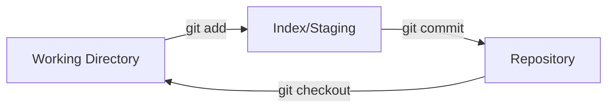

# Understanding Git Index

> The staging area between working directory and repository.

---

## 📁 What is the Index?

The index (staging area) is the intermediate step between working directory and commits.

---

## 📊 Index Flow



---

## 🔍 View Index

### List Files in Index

```bash
git ls-files
```

> Shows all tracked files in the index.

---

### List with Details

```bash
git ls-files -s
```

> Shows mode, hash, and stage number.

Output format:

```
100644 abc123... 0    file.txt
```

---

### Show Staged Changes

```bash
git diff --cached
```

> Shows what's staged for next commit.

---

### Show Staged File Names

```bash
git diff --cached --name-only
```

> Lists only file names that are staged.

---

## ➕ Add to Index

### Stage File

```bash
git add file.txt
```

> Adds file to staging area.

---

### Stage All

```bash
git add .
```

> Stages all changes.

---

### Interactive Add

```bash
git add -p
```

> Stage specific parts (hunks) of files.

Options:

- `y` - stage this hunk
- `n` - skip this hunk
- `s` - split into smaller hunks
- `e` - manually edit

---

## ➖ Remove from Index

### Unstage File (Modern)

```bash
git restore --staged file.txt
```

> Removes file from staging, keeps changes.

---

### Unstage File (Classic)

```bash
git reset HEAD file.txt
```

> Alternative way to unstage.

---

### Untrack File

```bash
git rm --cached file.txt
```

> Removes from Git tracking but keeps file.

---

## ⚙️ Advanced Index Operations

### Assume Unchanged

```bash
git update-index --assume-unchanged file.txt
```

> Git ignores changes to this file.

---

### Track Again

```bash
git update-index --no-assume-unchanged file.txt
```

> Resume tracking changes.

---

### Skip Worktree

```bash
git update-index --skip-worktree file.txt
```

> Skip file in checkout operations.

---

## 📋 Index Stages (Conflicts)

| Stage | Meaning              |
| ----- | -------------------- |
| 0     | Normal (no conflict) |
| 1     | Base version         |
| 2     | "Ours" version       |
| 3     | "Theirs" version     |

### View Unmerged

```bash
git ls-files -u
```

> Shows files with merge conflicts.

---

## 💡 Tips

> [!tip] Stage Parts of File
> Use `git add -p` to stage only specific changes.

> [!tip] View What's Staged
> Always check `git diff --cached` before commit.

---

## 🔗 Related

- [[git_objects|Git Objects]]
- [[git_commits_and_refs|Commits and Refs]]
- [[../02_Basic_Git_Commands/git_add_commit|git add]]

---

#git #index #staging #internals
