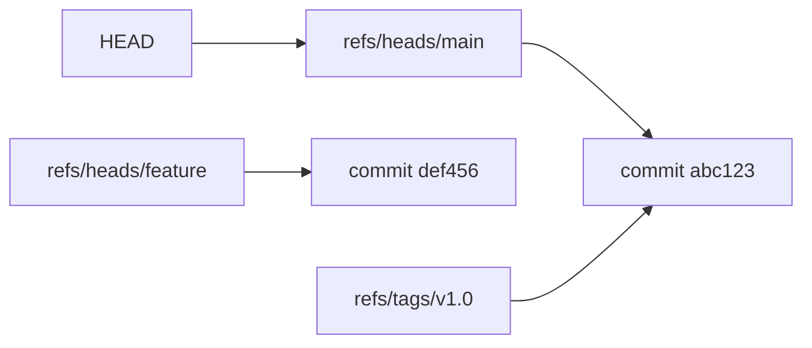

# git commits and refs

> Understanding commits and references.

---

## 📝 Commit Structure

A commit contains:

- Tree (snapshot)
- Parent(s)
- Author
- Committer
- Message

---

### View Commit Details

```bash
git cat-file -p HEAD
```

> Shows full commit object.

---

## 🏷️ Reference Types

| Ref      | Location             | Purpose          |
| -------- | -------------------- | ---------------- |
| HEAD     | `.git/HEAD`          | Current position |
| branches | `.git/refs/heads/`   | Branch tips      |
| remotes  | `.git/refs/remotes/` | Remote branches  |
| tags     | `.git/refs/tags/`    | Tag pointers     |

---

## 📊 Reference Diagram



---

## 🔍 View References

### Show HEAD

```bash
cat .git/HEAD
```

> Shows what HEAD points to.

---

### Show Branch Ref

```bash
cat .git/refs/heads/main
```

> Shows commit hash of main branch.

---

### Show All Refs

```bash
git show-ref
```

> Lists all references.

---

### Resolve Reference

```bash
git rev-parse HEAD
```

> Shows full commit hash.

---

### Resolve to Short Hash

```bash
git rev-parse --short HEAD
```

> Shows short commit hash.

---

## 📍 Reference Syntax

### Direct Reference

```bash
git show main
```

> Shows main branch tip.

---

### Parent Reference

```bash
git show HEAD~1
```

> Shows parent of HEAD.

---

### Grandparent

```bash
git show HEAD~2
```

> Shows 2 commits before HEAD.

---

### First Parent (Merge)

```bash
git show HEAD^1
```

> First parent of merge commit.

---

### Second Parent (Merge)

```bash
git show HEAD^2
```

> Second parent (merged branch).

---

### By Date

```bash
git show main@{yesterday}
```

> Shows main as of yesterday.

---

### By Reflog Index

```bash
git show HEAD@{5}
```

> Shows HEAD from 5 moves ago.

---

## 📋 Commit Ranges

### Commits in B not in A

```bash
git log A..B
```

> Shows commits reachable from B but not A.

---

### Commits in Either

```bash
git log A...B
```

> Shows commits in A or B but not both.

---

## 🔧 Update References

### Update Branch Ref

```bash
git update-ref refs/heads/main abc1234
```

> Manually updates branch to commit.

---

### Delete Reference

```bash
git update-ref -d refs/heads/old-branch
```

> Removes a reference.

---

## 💡 Tips

> [!tip] HEAD States
>
> - Attached: `ref: refs/heads/main`
> - Detached: `abc123...` (raw hash)

> [!tip] Symbolic Ref
>
> ```bash
> git symbolic-ref HEAD
> ```
>
> Shows which branch HEAD is on.

---

## 🔗 Related

- [[git_objects|Git Objects]]
- [[git_detailed_history|Detailed History]]
- [[../08_Git_Advanced_Topics/git_reflog|reflog]]

---

#git #commits #refs #internals
