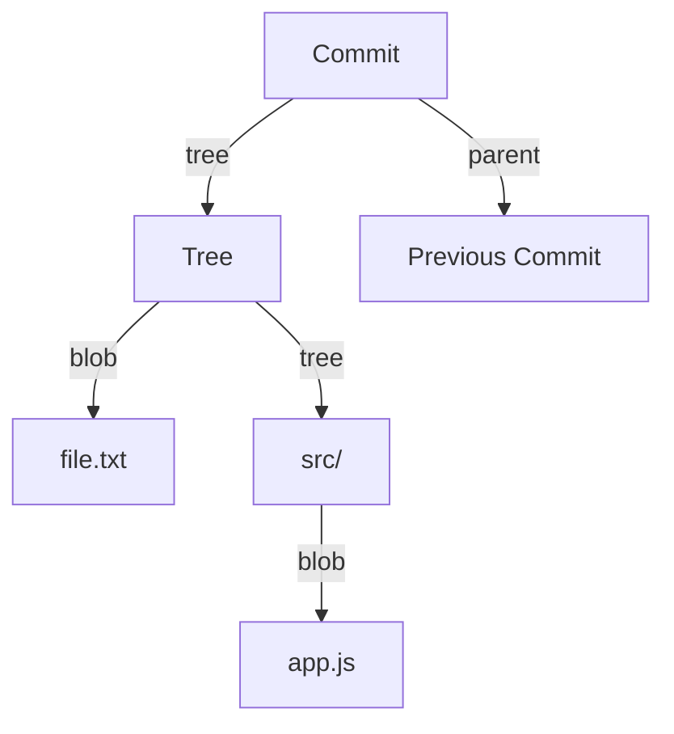

# git objects

> Understanding Git's internal data structures.

---

## 🧱 Object Types

| Type       | Description         |
| ---------- | ------------------- |
| **blob**   | File contents       |
| **tree**   | Directory listing   |
| **commit** | Snapshot + metadata |
| **tag**    | Named reference     |

---

## 📊 Object Relationships



---

## 🔍 Examine Objects

### View Object Type

```bash
git cat-file -t abc1234
```

> Shows type: blob, tree, commit, or tag.

---

### View Object Content

```bash
git cat-file -p abc1234
```

> Displays the content of the object.

---

### View Object Size

```bash
git cat-file -s abc1234
```

> Shows size in bytes.

---

## 📦 Blob Objects

### Create Blob (Hash a File)

```bash
echo "Hello" | git hash-object --stdin
```

> Computes SHA-1 hash of content.

---

### Store Blob

```bash
echo "Hello" | git hash-object -w --stdin
```

> Computes hash AND stores blob.

---

### View Blob Content

```bash
git cat-file -p abc123
```

> Displays file contents.

---

## 🌳 Tree Objects

### View Tree

```bash
git cat-file -p HEAD^{tree}
```

> Shows directory contents of HEAD.

Output:

```
100644 blob abc123  README.md
040000 tree def456  src
```

---

### View Subtree

```bash
git ls-tree HEAD src/
```

> Lists contents of src/ directory.

---

## 📝 Commit Objects

### View Commit

```bash
git cat-file -p HEAD
```

> Shows commit details.

Output:

```
tree abc123...
parent def456...
author Name <email> timestamp
committer Name <email> timestamp

Commit message
```

---

### Show Commit Tree

```bash
git show HEAD --format="%T"
```

> Shows tree hash of commit.

---

## 🏷️ Tag Objects

### View Tag

```bash
git cat-file -p v1.0.0
```

> Shows tag details (for annotated tags).

---

## 📊 Object Storage

Objects stored in `.git/objects/`:

```
.git/objects/
├── ab/
│   └── cd1234...   # First 2 chars = folder
├── pack/
│   └── pack-*.pack # Compressed objects
```

---

## 📈 Object Commands

### Count Objects

```bash
git count-objects -v
```

> Shows object count and size.

---

### Verify Objects

```bash
git fsck
```

> Checks object integrity.

---

### Garbage Collect

```bash
git gc
```

> Cleans up and optimizes object storage.

---

## 💡 Tips

> [!tip] Explore Any Object
>
> ```bash
> git cat-file -p main:src/app.js
> ```
>
> View specific file at specific branch.

> [!tip] Objects are Immutable
> Once created, objects never change - new versions get new hashes.

---

## 🔗 Related

- [[Understanding_Git_Index|Git Index]]
- [[git_commits_and_refs|Commits and Refs]]
- [[../08_Git_Advanced_Topics/git_reflog|reflog]]

---

#git #objects #internals #blob #tree
