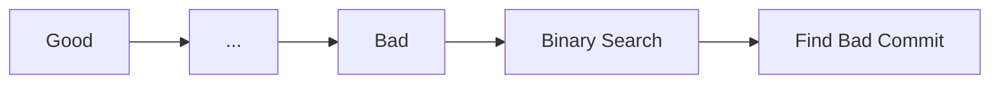

# git bisect

> Binary search to find bug-introducing commit.

---

## 🔍 How Bisect Works



---

## 🚀 Start Bisect

### Begin Session

```bash
git bisect start
```

> Starts bisect session.

---

### Mark Current as Bad

```bash
git bisect bad
```

> Marks current commit as having the bug.

---

### Mark Known Good Commit

```bash
git bisect good abc1234
```

> Marks a commit where bug didn't exist.

---

### Start with Both

```bash
git bisect start HEAD abc1234
```

> Starts with bad (HEAD) and good commit.

---

## 🔄 During Bisect

### Mark as Good

```bash
git bisect good
```

> Current commit doesn't have the bug.

---

### Mark as Bad

```bash
git bisect bad
```

> Current commit has the bug.

---

### Skip Current Commit

```bash
git bisect skip
```

> Can't test this commit (e.g., doesn't build).

---

## ✅ Finish Bisect

### End Session

```bash
git bisect reset
```

> Returns to original HEAD and ends bisect.

---

### Reset to Specific Commit

```bash
git bisect reset abc1234
```

> Returns to specific commit instead.

---

## 🤖 Automated Bisect

### Run Test Script

```bash
git bisect run ./test-script.sh
```

> Automatically tests each commit. Script returns 0 for good, 1 for bad.

---

### Example Test Script

```bash
#!/bin/bash
npm test
```

> Simple test script for bisect run.

---

### Run with Command

```bash
git bisect run npm test
```

> Uses npm test to determine good/bad.

---

## 📋 View Bisect Log

### Show Log

```bash
git bisect log
```

> Shows history of bisect session.

---

### Replay Bisect

```bash
git bisect log > bisect.log
git bisect replay bisect.log
```

> Saves and replays bisect session.

---

## 💡 Example Session

```bash
# Start bisect
git bisect start

# Current commit is broken
git bisect bad

# This old commit worked
git bisect good v1.0.0

# Git checks out middle commit
# Test it, then mark:
git bisect good  # or git bisect bad

# Repeat until found
# Git says: "abc123 is the first bad commit"

# End session
git bisect reset
```

---

## 💡 Tips

> [!tip] Use Automated Testing
> Bisect is most powerful with automated tests.

> [!tip] Visual Bisect
>
> ```bash
> git bisect visualize
> ```
>
> Opens visual representation.

---

## 🔗 Related

- [[git_filter_branch|Filter Branch]]
- [[git_reflog|Reflog]]
- [[../07_Git_Internals/git_detailed_history|History]]

---

#git #bisect #debug #advanced
