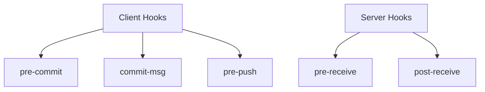

# git hooks

> Automate actions at Git events.

---

## 📁 Hook Location

Hooks are in `.git/hooks/`

```bash
ls .git/hooks/
```

> Lists available hook samples.

---

## 📊 Hook Types



---

## 🔧 Create Hook

### Make Hook File

```bash
touch .git/hooks/pre-commit
```

> Creates hook file.

---

### Make Executable

```bash
chmod +x .git/hooks/pre-commit
```

> Makes hook executable (required).

---

## 📋 Common Client Hooks

### pre-commit

Runs before commit is created.

```bash
#!/bin/bash
# .git/hooks/pre-commit

npm test
```

> Exit non-zero to cancel commit.

---

### commit-msg

Validates commit message.

```bash
#!/bin/bash
# .git/hooks/commit-msg

message=$(cat "$1")
if ! [[ "$message" =~ ^(feat|fix|docs): ]]; then
    echo "Error: Message must start with feat:, fix:, or docs:"
    exit 1
fi
```

> Enforces commit message format.

---

### pre-push

Runs before push.

```bash
#!/bin/bash
# .git/hooks/pre-push

npm test
```

> Cancel push if tests fail.

---

### post-checkout

Runs after checkout.

```bash
#!/bin/bash
# .git/hooks/post-checkout

npm install
```

> Install dependencies after checkout.

---

## 📦 Sharing Hooks

### Create Hooks Directory

```bash
mkdir .githooks
```

> Create hooks in version control.

---

### Configure Git to Use

```bash
git config core.hooksPath .githooks
```

> Points Git to shared hooks.

---

## 🛠️ Hook Management Tools

### Install Husky

```bash
npm install husky --save-dev
```

> Popular hook manager for Node.js projects.

---

### Initialize Husky

```bash
npx husky install
```

> Sets up Husky.

---

### Add Husky Pre-commit

```bash
npx husky add .husky/pre-commit "npm test"
```

> Adds pre-commit hook.

---

### Install pre-commit (Python)

```bash
pip install pre-commit
```

> Python-based hook manager.

---

### Run pre-commit Install

```bash
pre-commit install
```

> Installs hooks from config.

---

## 📋 Example .pre-commit-config.yaml

```yaml
repos:
  - repo: https://github.com/pre-commit/pre-commit-hooks
    rev: v4.4.0
    hooks:
      - id: trailing-whitespace
      - id: end-of-file-fixer
```

> Configuration for pre-commit.

---

## ⏭️ Skip Hooks

### Skip Pre-commit

```bash
git commit --no-verify -m "Message"
```

> Skips pre-commit and commit-msg hooks.

---

### Skip Pre-push

```bash
git push --no-verify
```

> Skips pre-push hooks.

---

## 💡 Tips

> [!tip] Debug Hooks
> Add `set -x` at top of script for debugging.

> [!tip] Keep Hooks Fast
> Slow hooks annoy developers. Use caching.

---

## 🔗 Related

- [[git_bisect|Bisect]]
- [[../10_GitHub_Advanced_Concepts/GitHub_CICD|CI/CD]]

---

#git #hooks #automation #advanced
