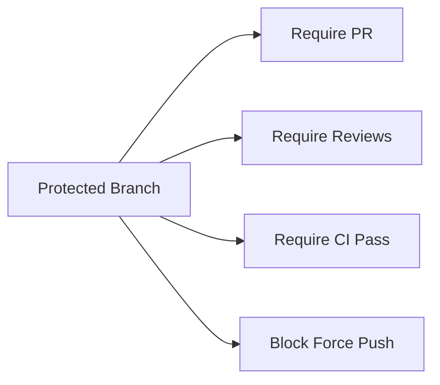

# Branch Protection Rules

> Protect important branches with rules.

---

## 📊 Overview



---

## ⚙️ Configure via Web

1. Go to repo Settings
2. Click "Branches"
3. Add rule for branch pattern

---

## 🔧 Configure via CLI

### Create Rule

```bash
gh api repos/{owner}/{repo}/branches/{branch}/protection -X PUT \
  -H "Accept: application/vnd.github.v3+json" \
  -f required_status_checks='{"strict":true,"contexts":["ci/test"]}' \
  -f enforce_admins=true \
  -f required_pull_request_reviews='{"dismiss_stale_reviews":true,"require_code_owner_reviews":true}'
```

> Creates branch protection via API.

---

### View Protection

```bash
gh api repos/{owner}/{repo}/branches/{branch}/protection
```

> Shows current protection settings.

---

### Delete Protection

```bash
gh api repos/{owner}/{repo}/branches/{branch}/protection -X DELETE
```

> Removes branch protection.

---

## 📋 Common Rules

### Require Pull Request

- No direct pushes
- Changes must go through PR

---

### Require Approvals

```bash
gh api repos/{owner}/{repo}/branches/main/protection \
  -f required_pull_request_reviews='{"required_approving_review_count":2}'
```

> Requires 2 approving reviews.

---

### Require Status Checks

```bash
gh api repos/{owner}/{repo}/branches/main/protection \
  -f required_status_checks='{"strict":true,"contexts":["ci/test","ci/lint"]}'
```

> Requires CI checks to pass.

---

### Require Up-to-date Branch

The `strict: true` setting requires branch to be up to date before merging.

---

### Block Force Push

Enabled by default with protection.

---

### Require Signed Commits

```bash
gh api repos/{owner}/{repo}/branches/main/protection/required_signatures -X POST
```

> Requires GPG signed commits.

---

## 📁 CODEOWNERS

Create `.github/CODEOWNERS`:

```
# Default owners
* @default-team

# Specific paths
/src/ @frontend-team
/api/ @backend-team
*.js @js-experts
```

> Automatically requests reviews from code owners.

---

## 💡 Tips

> [!tip] Pattern Matching
> Use `*` for all branches, `release/*` for release branches.

> [!tip] Admin Override
> Decide if admins can bypass rules.

---

## 🔗 Related

- [[../06_Git_Workflows/Pull_Requests|Pull Requests]]
- [[../10_GitHub_Advanced_Concepts/Code_Reviews_and_Approvals|Code Reviews]]

---

#github #protection #rules #branches
