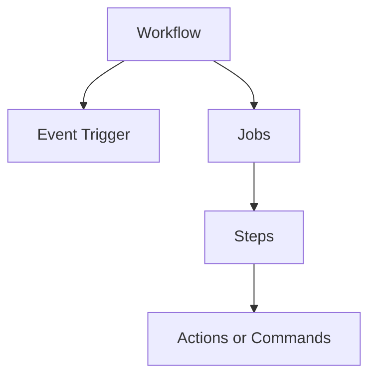

# GitHub Actions

> Automate workflows directly in your repository.

---

## 📁 Workflow Location

```
.github/workflows/
├── ci.yml
├── deploy.yml
└── test.yml
```

---

## 📊 Workflow Structure



---

## 🚀 Basic Workflow

Create `.github/workflows/ci.yml`:

```yaml
name: CI

on:
  push:
    branches: [main]
  pull_request:
    branches: [main]

jobs:
  build:
    runs-on: ubuntu-latest
    steps:
      - uses: actions/checkout@v4
      - run: npm install
      - run: npm test
```

---

## 📋 Event Triggers

### On Push

```yaml
on:
  push:
    branches: [main, develop]
```

> Runs on push to specified branches.

---

### On Pull Request

```yaml
on:
  pull_request:
    branches: [main]
```

> Runs on PRs to main.

---

### Scheduled

```yaml
on:
  schedule:
    - cron: "0 0 * * *"
```

> Runs daily at midnight UTC.

---

### Manual Dispatch

```yaml
on:
  workflow_dispatch:
    inputs:
      environment:
        description: "Deploy environment"
        required: true
        default: "staging"
```

> Manually trigger with inputs.

---

## 🏃 Jobs

### Single Job

```yaml
jobs:
  test:
    runs-on: ubuntu-latest
    steps:
      - uses: actions/checkout@v4
      - run: npm test
```

> Basic job structure.

---

### Multiple Jobs

```yaml
jobs:
  test:
    runs-on: ubuntu-latest
    steps:
      - run: npm test

  build:
    runs-on: ubuntu-latest
    needs: test
    steps:
      - run: npm run build
```

> Build depends on test passing.

---

### Matrix Strategy

```yaml
jobs:
  test:
    strategy:
      matrix:
        node: [16, 18, 20]
        os: [ubuntu-latest, windows-latest]
    runs-on: ${{ matrix.os }}
    steps:
      - uses: actions/setup-node@v4
        with:
          node-version: ${{ matrix.node }}
```

> Runs on multiple Node versions and OS.

---

## 📦 Common Actions

### Checkout Code

```yaml
- uses: actions/checkout@v4
```

> Checks out your repository.

---

### Setup Node.js

```yaml
- uses: actions/setup-node@v4
  with:
    node-version: "20"
    cache: "npm"
```

> Sets up Node with caching.

---

### Setup Python

```yaml
- uses: actions/setup-python@v5
  with:
    python-version: "3.11"
```

> Sets up Python.

---

### Cache Dependencies

```yaml
- uses: actions/cache@v4
  with:
    path: ~/.npm
    key: ${{ runner.os }}-npm-${{ hashFiles('**/package-lock.json') }}
```

> Caches npm dependencies.

---

## 🔧 CLI Commands

### List Workflows

```bash
gh workflow list
```

> Shows all workflows.

---

### Run Workflow

```bash
gh workflow run workflow-name.yml
```

> Manually triggers workflow.

---

### View Run

```bash
gh run view
```

> Shows recent run details.

---

### Watch Run

```bash
gh run watch
```

> Live-watch a running workflow.

---

### List Runs

```bash
gh run list
```

> Shows recent workflow runs.

---

### View Logs

```bash
gh run view --log
```

> Shows logs for a run.

---

## 💡 Tips

> [!tip] Test Locally
> Use `act` to test GitHub Actions locally.

> [!tip] Reuse Workflows
> Use `workflow_call` for reusable workflows.

---

## 🔗 Related

- [[../10_GitHub_Advanced_Concepts/GitHub_CICD|CI/CD]]
- [[../10_GitHub_Advanced_Concepts/GitHub_Actions_and_Pipelines|Advanced Actions]]

---

#github #actions #cicd #automation
