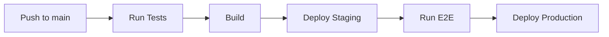

# Automated Deployments

> Deploy automatically with GitHub Actions.

---

## 📊 Deployment Flow



---

## 🚀 Basic Deploy Workflow

```yaml
name: Deploy

on:
  push:
    branches: [main]

jobs:
  deploy:
    runs-on: ubuntu-latest
    steps:
      - uses: actions/checkout@v4
      - run: npm install
      - run: npm run build
      - run: npm run deploy
```

---

## 🌐 Deploy to GitHub Pages

```yaml
name: Deploy to GitHub Pages

on:
  push:
    branches: [main]

jobs:
  deploy:
    runs-on: ubuntu-latest
    permissions:
      pages: write
      id-token: write
    environment:
      name: github-pages
    steps:
      - uses: actions/checkout@v4
      - run: npm install && npm run build
      - uses: actions/upload-pages-artifact@v3
        with:
          path: ./dist
      - uses: actions/deploy-pages@v4
```

---

## ☁️ Deploy to AWS S3

```yaml
- name: Deploy to S3
  env:
    AWS_ACCESS_KEY_ID: ${{ secrets.AWS_ACCESS_KEY_ID }}
    AWS_SECRET_ACCESS_KEY: ${{ secrets.AWS_SECRET_ACCESS_KEY }}
  run: |
    aws s3 sync ./dist s3://my-bucket --delete
```

> Syncs build to S3 bucket.

---

## 🔷 Deploy to Vercel

```yaml
- name: Deploy to Vercel
  uses: amondnet/vercel-action@v25
  with:
    vercel-token: ${{ secrets.VERCEL_TOKEN }}
    vercel-org-id: ${{ secrets.ORG_ID }}
    vercel-project-id: ${{ secrets.PROJECT_ID }}
```

> Deploy to Vercel.

---

## 🐳 Deploy with Docker

```yaml
- name: Build and Push Docker
  run: |
    docker build -t myapp:${{ github.sha }} .
    docker push myapp:${{ github.sha }}
```

> Builds and pushes Docker image.

---

## 🔐 Environment Protection

```yaml
jobs:
  deploy-production:
    runs-on: ubuntu-latest
    environment:
      name: production
      url: https://myapp.com
```

> Uses protected environment.

---

## 📊 Deployment Strategies

### Blue-Green

```yaml
- name: Switch traffic
  run: |
    # Deploy to green
    # Switch load balancer to green
    # Remove blue
```

---

### Canary

```yaml
- name: Canary deploy
  run: |
    # Deploy to 10% of servers
    # Monitor
    # If good, deploy to 100%
```

---

## 🔧 CLI Commands

### List Deployments

```bash
gh api repos/{owner}/{repo}/deployments
```

> Shows deployments.

---

### Create Deployment

```bash
gh api repos/{owner}/{repo}/deployments -X POST \
  -f ref="main" \
  -f environment="production"
```

> Creates deployment.

---

## 💡 Tips

> [!tip] Use Environments
> Configure environments in repo settings with required reviewers.

> [!tip] Rollback
> Tag each deploy and re-run previous tag's workflow.

---

## 🔗 Related

- [[GitHub_CICD|CI/CD]]
- [[GitHub_Actions_and_Pipelines|Actions & Pipelines]]

---

#github #deploy #automation #cicd
