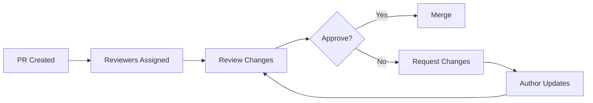

# Code Reviews and Approvals

> Best practices for reviewing code.

---

## 📊 Review Flow



---

## 🔧 CLI Review Commands

### Request Review

```bash
gh pr edit 123 --add-reviewer username
```

> Adds reviewer to PR.

---

### Approve PR

```bash
gh pr review 123 --approve
```

> Approves the pull request.

---

### Approve with Comment

```bash
gh pr review 123 --approve --body "LGTM!"
```

> Approves with message.

---

### Request Changes

```bash
gh pr review 123 --request-changes --body "Please fix the validation logic"
```

> Requests changes before merge.

---

### Comment Only

```bash
gh pr review 123 --comment --body "Have you considered..."
```

> Adds comment without approval.

---

### View Review Status

```bash
gh pr view 123
```

> Shows review status.

---

## 📋 Review Checklist

### What to Check

- [ ] Code compiles/runs
- [ ] Tests pass
- [ ] No security issues
- [ ] Documentation updated
- [ ] No unnecessary complexity
- [ ] Follows coding standards

---

## 💬 Review Comments

### Good Comment Examples

```
Consider extracting this into a function for reusability.
```

```
This might cause N+1 queries. Consider using eager loading.
```

```
Nice solution! Much cleaner than the previous approach.
```

---

### Avoid These

```
This is wrong.
```

```
Why did you do this?
```

Use constructive language instead.

---

## 📁 CODEOWNERS

Create `.github/CODEOWNERS`:

```
# Default
* @team-lead

# By path
/src/frontend/ @frontend-team
/src/api/ @backend-team

# By type
*.js @js-experts
*.py @python-team
```

> Auto-assigns reviewers by path.

---

## ⚙️ Branch Protection

### Require Approvals

Set in repo settings:

- Require 1-2 approving reviews
- Dismiss stale reviews on new commits
- Require review from code owners

---

## 💡 Tips

> [!tip] Small PRs
> Keep PRs small (< 400 lines) for better reviews.

> [!tip] Self-Review First
> Review your own PR before requesting others.

> [!tip] Be Timely
> Review within 24 hours when possible.

---

## 🔗 Related

- [[../06_Git_Workflows/Pull_Requests|Pull Requests]]
- [[../09_GitHub_Commands_and_Features/Branch_Protection_Rules|Branch Protection]]

---

#github #review #approval #codereview
