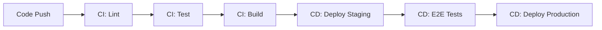

# GitHub CI/CD

> Continuous Integration and Continuous Deployment.

---

## 📊 CI/CD Pipeline



---

## 🔍 Continuous Integration

### Complete CI Workflow

```yaml
name: CI

on:
  push:
    branches: [main, develop]
  pull_request:
    branches: [main]

jobs:
  lint:
    runs-on: ubuntu-latest
    steps:
      - uses: actions/checkout@v4
      - uses: actions/setup-node@v4
        with:
          node-version: "20"
          cache: "npm"
      - run: npm ci
      - run: npm run lint

  test:
    runs-on: ubuntu-latest
    steps:
      - uses: actions/checkout@v4
      - uses: actions/setup-node@v4
        with:
          node-version: "20"
          cache: "npm"
      - run: npm ci
      - run: npm test

  build:
    needs: [lint, test]
    runs-on: ubuntu-latest
    steps:
      - uses: actions/checkout@v4
      - run: npm ci
      - run: npm run build
      - uses: actions/upload-artifact@v4
        with:
          name: build
          path: dist/
```

---

## 🚀 Continuous Deployment

### CD to Staging

```yaml
deploy-staging:
  needs: build
  runs-on: ubuntu-latest
  environment:
    name: staging
    url: https://staging.myapp.com
  steps:
    - uses: actions/download-artifact@v4
      with:
        name: build
    - run: ./deploy.sh staging
      env:
        DEPLOY_KEY: ${{ secrets.STAGING_DEPLOY_KEY }}
```

> Deploys to staging environment.

---

### CD to Production

```yaml
deploy-production:
  needs: deploy-staging
  runs-on: ubuntu-latest
  environment:
    name: production
    url: https://myapp.com
  steps:
    - uses: actions/download-artifact@v4
      with:
        name: build
    - run: ./deploy.sh production
      env:
        DEPLOY_KEY: ${{ secrets.PROD_DEPLOY_KEY }}
```

> Deploys to production after staging.

---

## 🛡️ Environment Protection

### Configure in Settings

1. Go to Settings → Environments
2. Create environment (staging, production)
3. Add protection rules:
   - Required reviewers
   - Wait timer
   - Branch restrictions

---

## 📊 Status Checks

### Required Checks

Set in branch protection:

- Require status checks to pass
- Select required jobs

---

### View Status

```bash
gh run list
```

> Shows recent runs.

---

### View Failed Run

```bash
gh run view --log-failed
```

> Shows logs of failed jobs.

---

## 🔧 CLI Commands

### Trigger Deploy

```bash
gh workflow run deploy.yml
```

> Manually triggers deployment.

---

### Trigger with Inputs

```bash
gh workflow run deploy.yml -f environment=production
```

> Triggers with environment input.

---

### Watch Deployment

```bash
gh run watch
```

> Live-watch running deployment.

---

## 💡 Tips

> [!tip] Rollback Strategy
> Keep deployable artifacts tagged for quick rollback.

> [!tip] Deployment Frequency
> Deploy to staging on every PR merge, production on releases.

---

## 🔗 Related

- [[GitHub_Actions_and_Pipelines|Actions & Pipelines]]
- [[Automated_Deployments|Deployments]]

---

#github #cicd #deploy #automation
