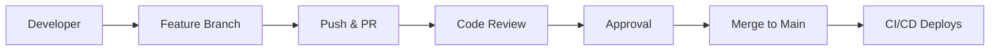

# Collaborative Workflows

> Team collaboration patterns for large projects.

---

## 📊 Team Workflow



---

## 🌿 Feature Branch Workflow

### Create Feature Branch

```bash
git checkout main
```

> Start from main.

```bash
git pull origin main
```

> Get latest changes.

```bash
git checkout -b feature/USER-123-add-login
```

> Create descriptive branch.

---

### Work Incrementally

```bash
git add .
```

> Stage changes.

```bash
git commit -m "feat: add login form component"
```

> Small, focused commits.

---

### Keep Updated

```bash
git fetch origin main
```

> Get remote changes.

```bash
git rebase origin/main
```

> Keep branch current.

---

### Push for Review

```bash
git push -u origin feature/USER-123-add-login
```

> Push branch.

```bash
gh pr create --fill
```

> Create PR.

---

## 👥 Code Review Process

### Self-Review First

```bash
git diff main...HEAD
```

> Review your own changes.

---

### Request Reviewers

```bash
gh pr edit --add-reviewer teammate1,teammate2
```

> Add reviewers.

---

### Address Feedback

```bash
git commit -m "fix: address review feedback"
```

> Commit fixes.

```bash
git push
```

> Push updates.

---

## 🔄 Sync with Team

### Morning Sync

```bash
git checkout main
```

> Switch to main.

```bash
git pull origin main
```

> Get overnight changes.

```bash
git checkout -
```

> Back to feature branch.

```bash
git rebase main
```

> Incorporate changes.

---

## 🏷️ Commit Conventions

### Conventional Commits

```
type(scope): description

[optional body]

[optional footer]
```

**Types:**

- `feat` - New feature
- `fix` - Bug fix
- `docs` - Documentation
- `refactor` - Code change
- `test` - Add tests
- `chore` - Maintenance

---

## 💡 Tips

> [!tip] Communication
> Comment on PRs early with status updates.

> [!tip] Pair Programming
>
> ```bash
> git commit --author="Partner <partner@email.com>" -m "feat: pair programmed"
> ```

---

## 🔗 Related

- [[Git_Workflow_for_FAANG|FAANG Workflow]]
- [[../06_Git_Workflows/Pull_Requests|Pull Requests]]

---

#git #collaboration #workflow #team
