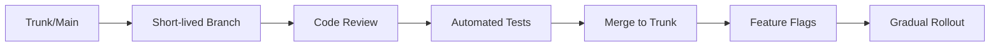

# Git Workflow for FAANG

> Enterprise-level Git practices at scale.

---

## 📊 FAANG Workflow



---

## 🔄 Trunk-Based Development

### Work on Short Branches

```bash
git checkout main
```

> Start from main.

```bash
git pull --rebase origin main
```

> Get latest with rebase.

```bash
git checkout -b user/feature-name
```

> Short-lived branch (< 2 days).

---

### Small Commits

```bash
git commit -am "Small incremental change"
```

> Many small commits, not one big one.

---

### Merge Same Day

```bash
git checkout main
```

> Switch to main.

```bash
git merge --no-ff user/feature-name
```

> Merge quickly.

---

## 🏁 Feature Flags

### Code Behind Flag

```javascript
if (featureFlags.newLogin) {
  // New implementation
} else {
  // Old implementation
}
```

> Deploy dark code with flags.

---

## 📋 Commit Message Standards

### Format

```
[JIRA-123] type: Short description

Longer explanation if needed.
- Bullet points work too
- Be specific

Test Plan:
- How was this tested?

Reviewers: @teammate
```

---

## 🔍 Code Review Standards

### Before Submitting

```bash
git diff main...HEAD
```

> Self-review changes.

```bash
npm test
```

> Run all tests locally.

```bash
npm run lint
```

> Ensure lint passes.

---

### Small PRs

Keep PRs under 400 lines for faster review.

---

## 🔐 Security Practices

### Never Commit Secrets

```bash
git secrets --scan
```

> Scan for secrets before commit.

---

### Use .gitignore

```
.env
*.pem
credentials.json
```

> Ignore sensitive files.

---

## ⚡ Performance at Scale

### Shallow Clone

```bash
git clone --depth 50 repo.git
```

> Faster clone for CI.

---

### Sparse Checkout

```bash
git sparse-checkout init
```

> Work on subset of repo.

```bash
git sparse-checkout set src/my-service
```

> Only checkout what you need.

---

### Git LFS

```bash
git lfs install
```

> For large files.

```bash
git lfs track "*.psd"
```

> Track large file types.

---

## 📊 Monitoring & Metrics

Track:

- Time to merge
- PR size
- Review turnaround
- CI pass rate

---

## 💡 Tips

> [!tip] Never Rebase Public
> Once pushed to main, never rebase.

> [!tip] CI Before Review
> All tests must pass before requesting review.

---

## 🔗 Related

- [[Collaborative_Workflows|Collaboration]]
- [[Large_Scale_Repos_and_Branches|Large Repos]]

---

#git #faang #enterprise #workflow
