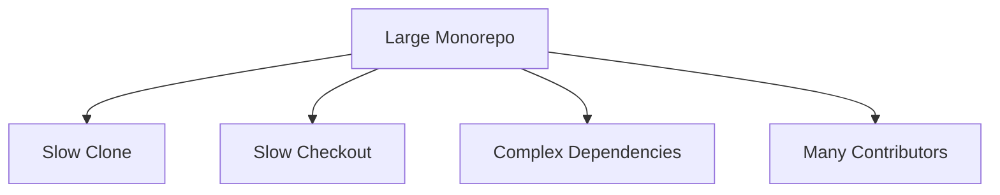

# Large Scale Repos and Branches

> Managing massive repositories.

---

## 📊 Monorepo Challenges



---

## ⚡ Faster Clone

### Shallow Clone

```bash
git clone --depth 1 repo.git
```

> Only latest commit.

---

### Single Branch Clone

```bash
git clone --single-branch -b main repo.git
```

> Only clone main branch.

---

### Blobless Clone

```bash
git clone --filter=blob:none repo.git
```

> Downloads structure without file contents. Fetches on demand.

---

### Treeless Clone

```bash
git clone --filter=tree:0 repo.git
```

> Most minimal clone. Fetches trees on demand.

---

## 📁 Sparse Checkout

### Enable Sparse Checkout

```bash
git sparse-checkout init
```

> Enables sparse checkout mode.

---

### Set Paths to Include

```bash
git sparse-checkout set src/my-service shared/utils
```

> Only checkout these paths.

---

### Add More Paths

```bash
git sparse-checkout add tests/my-service
```

> Adds more paths.

---

### List Current Patterns

```bash
git sparse-checkout list
```

> Shows what's included.

---

### Disable Sparse Checkout

```bash
git sparse-checkout disable
```

> Returns to full checkout.

---

## 📦 Git LFS

### Install LFS

```bash
git lfs install
```

> Sets up LFS in repo.

---

### Track Large Files

```bash
git lfs track "*.psd"
```

> Tracks Photoshop files.

```bash
git lfs track "*.zip"
```

> Tracks zip files.

---

### View Tracked Patterns

```bash
cat .gitattributes
```

> Shows LFS patterns.

---

### List LFS Files

```bash
git lfs ls-files
```

> Shows files in LFS.

---

## 🌿 Branch Management

### List Remote Branches

```bash
git branch -r
```

> Shows all remote branches.

---

### Delete Merged Branches

```bash
git branch --merged main | grep -v main | xargs git branch -d
```

> Cleans up merged branches.

---

### Prune Stale References

```bash
git remote prune origin
```

> Removes deleted remote branches.

---

## 📊 Repository Size

### Check Size

```bash
git count-objects -vH
```

> Shows repo size.

---

### Find Large Files

```bash
git rev-list --objects --all | git cat-file --batch-check='%(objecttype) %(objectname) %(objectsize) %(rest)' | sort -k3 -n -r | head -20
```

> Lists 20 largest files.

---

## ⚙️ Performance Config

### Enable Commit Graph

```bash
git config --global core.commitGraph true
```

> Speeds up history operations.

---

### Fast Status

```bash
git config --global core.untrackedCache true
```

> Caches untracked files.

---

### Enable Multi-pack Index

```bash
git config --global core.multiPackIndex true
```

> Faster pack operations.

---

## 💡 Tips

> [!tip] CI Optimization
> Use shallow clones in CI for speed.

> [!tip] Monorepo Tools
> Consider Nx, Turborepo, or Bazel for monorepo management.

---

## 🔗 Related

- [[Git_Workflow_for_FAANG|FAANG Workflow]]
- [[Collaborative_Workflows|Collaboration]]

---

#git #monorepo #largescale #performance
