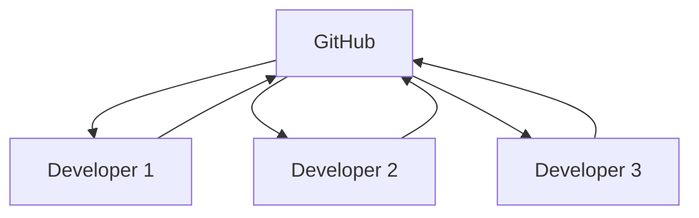

# System Design and Code Reviews

> Git in system design and review best practices.

---

## 🏗️ Git in System Design

### Distributed Version Control



All developers have full repository copy.

---

### Data Integrity

Git uses SHA-1 hashes to ensure data integrity.

```bash
git cat-file -t abc1234
```

> Every object is content-addressed.

---

## 📋 Interview Topics

### Git Internal Structure

| Object | Purpose             |
| ------ | ------------------- |
| blob   | File contents       |
| tree   | Directory structure |
| commit | Snapshot + metadata |
| tag    | Named pointer       |

---

### Common Interview Questions

1. **How does Git store data?**
   - Content-addressable filesystem
   - SHA-1 hashes
   - Objects: blob, tree, commit, tag

2. **Merge vs Rebase?**
   - Merge preserves history
   - Rebase creates linear history

3. **How to find a bug in history?**
   - Use `git bisect`

---

## 🔍 Code Review Best Practices

### Review Size

```bash
git diff --stat main...HEAD
```

> Check PR size before review.

Keep PRs under 400 lines.

---

### Review Checklist

- [ ] Code compiles
- [ ] Tests pass
- [ ] No secrets committed
- [ ] Documentation updated
- [ ] Follows style guide
- [ ] No unnecessary complexity

---

### Review Commands

```bash
gh pr checkout 123
```

> Checkout PR locally.

```bash
gh pr diff 123
```

> View PR diff.

```bash
gh pr review 123 --approve
```

> Approve PR.

---

## 💬 Effective Review Comments

### Good Examples

```
Consider using a map here for O(1) lookup instead of array.find()
```

```
This could cause N+1 queries. Consider eager loading.
```

```
Nice refactor! This is much more maintainable.
```

---

### Avoid

```
This is wrong.
```

```
Why?
```

Be constructive and specific.

---

## 🏢 Enterprise Patterns

### Branch Protection

- Require PR reviews
- Require CI passing
- Require signed commits

---

### CODEOWNERS

```
# .github/CODEOWNERS
* @team-lead
/src/api/ @backend-team
/src/ui/ @frontend-team
```

> Auto-assign reviewers.

---

## 💡 Tips

> [!tip] For Interviews
> Understand Git internals: objects, refs, index.

> [!tip] Review Etiquette
> Be kind, specific, and educational.

---

## 🔗 Related

- [[Collaborative_Workflows|Collaboration]]
- [[../10_GitHub_Advanced_Concepts/Code_Reviews_and_Approvals|Code Reviews]]

---

#git #systemdesign #codereview #interview
