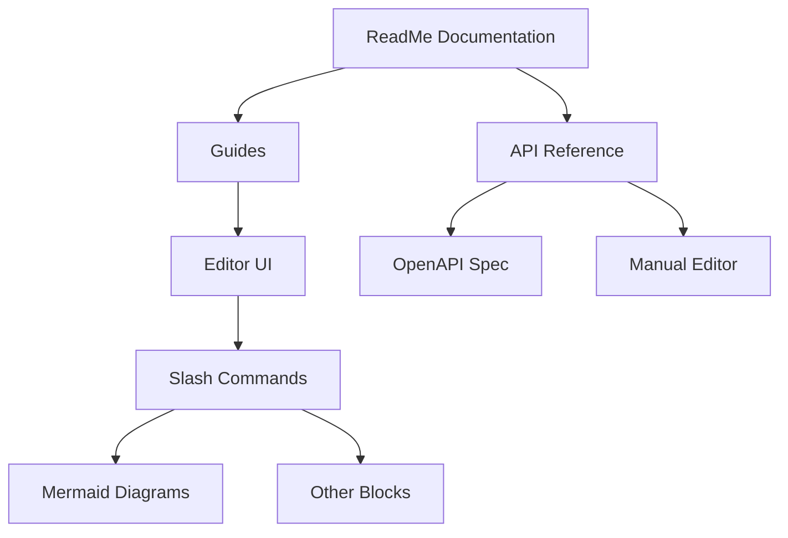

---
cssclasses:
title:
attendees:
---

```mermaid
flowchart TB
    A["ReadMe Documentation"]
    B["Guides"]
    C["API Reference"]
    D["Editor UI"]
    E["OpenAPI Spec"]
    F["Manual Editor"]
    G["Slash Commands"]
    H["Mermaid Diagrams"]
    I["Other Blocks"]
    A --> B
    A --> C
    B --> D
    C --> E
    C --> F
    D --> G
    G --> H
    G --> I
    %% mermaid-flow:pos A=125,60 B=125,260 C=321,290 D=44,408 E=229,460 F=372,460 G=125,660 H=102,860 I=258,860
```
