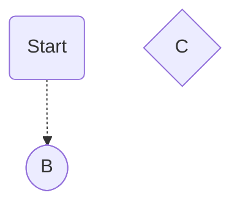

---
tags:
  - daily
  - 2026/05/21
full-date: 2026-05-21
week: 2026/W21
month: 2026/05-May
year: 2026
rating:
aliases:
---

#2026/2026-05/2026-05-21

[[2026-05-20|⇦ Yesterday]] ⁝ [[2026-05-22|Tomorrow ⇨]]

# Thursday — May 21st 2026

---

## 🏢 Work

- [x] Sent follow-up on payment processor contract
- [x] Reviewed Sara's PR for the 3DS crash fix — LGTM, approved
- [x] Write first draft of beta onboarding email sequence
- [x] Update [[Project Planning]] with new timeline from this morning's standup
- [x] Review Liam's brand palette mockups (shared on Figma) 🛫 2026-05-27 ✅ 2026-05-27

## 🧠 Deep Work Block (2pm – 4pm)

Focus: Write the API reference docs for the `/charge` endpoint. No Slack, no meetings.


## 🏢 Work

- [ ] Sent follow-up on payment processor contract
- [ ] Reviewed Sara's PR for the 3DS crash fix — LGTM, approved
- [ ] Write first draft of beta onboarding email sequence
- [x] Update [[Project Planning]] with new timeline from this morning's standup #daily #2026/05/21 #urgent #important
- [ ] Review Liam's brand palette mockups (shared on Figma)

## 📒 Journal

Today's standup was short — good sign. The 3DS fix going in is a relief, that bug has been blocking QA for a week. Feeling cautiously optimistic about the June 15 freeze date.

Spent lunch reading more of [[Learning - How LLMs Work]] — the RLHF section is clicking now. Want to ask Claude about DPO vs RLHF in more detail tonight.

## 💡 Ideas

- What if we shipped a "sandbox mode" with NovaPay that generates fake successful payments for demo/testing? Developers always want this.
- Could use the AI Browser Chat plugin to summarise all open beta partner notes before tomorrow's check-in call.

## 📚 Reading

- Continuing *Atomic Habits* — just hit the Goldilocks Rule chapter ([[Book Notes - Atomic Habits]])
- Queue: "Staff Engineer" by Will Larson





---

## DataView

> [!done]- Completed Today
> ```dataview
> TASK WHERE completion = date("2026-05-21")
>   AND due != date("2026-05-21")
> ```

> [!bomb]- Created Today
> ```dataview
> TABLE file.ctime as "Created"
> WHERE file.cday = date("2026-05-21")
>   AND !regexmatch("^\d{4}-\d{2}-\d{2}", file.name)
> SORT file.name ASC
> ```

---
