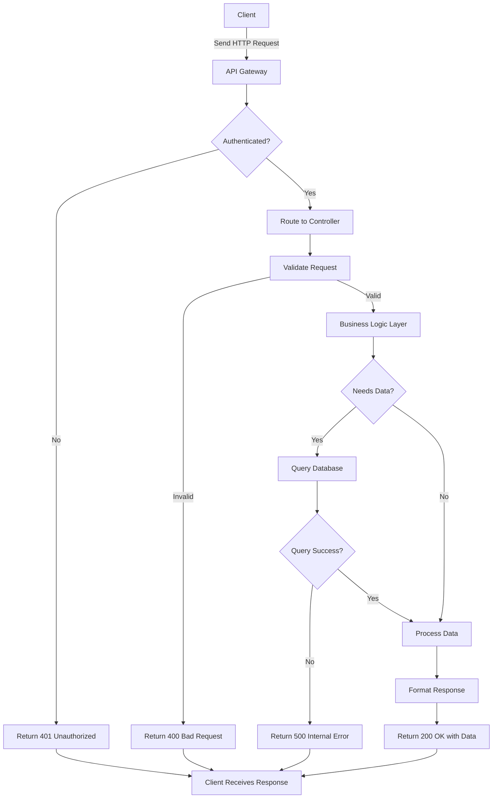

```mermaid
flowchart TB
    A["Client"]
    B["API Gateway"]
    C{"Authenticated?"}
    D["Return 401 Unauthorized"]
    E["Route to Controller"]
    F["Validate Request"]
    G["Return 400 Bad Request"]
    H["Business Logic Layer"]
    I{"Needs Data?"}
    J["Query Database"]
    K{"Query Success?"}
    L["Return 500 Internal Error"]
    M["Process Data"]
    N["Format Response"]
    O["Return 200 OK with Data"]
    P["Client Receives Response"]
    A -->|"Send HTTP Request"| B
    B --> C
    C -->|"No"| D
    C -->|"Yes"| E
    E --> F
    F -->|"Invalid"| G
    F -->|"Valid"| H
    H --> I
    I -->|"Yes"| J
    J --> K
    K -->|"No"| L
    K -->|"Yes"| M
    I -->|"No"| M
    M --> N
    N --> O
    D --> P
    G --> P
    L --> P
    O --> P
    %% mermaid-flow:pos A=552,82 B=552,176 C=552,284 D=940,1200 E=424,392 F=424,486 G=683,1200 H=295,580 I=295,688 J=415,796 K=415,904 L=425,1200 M=165,1012 N=165,1106 O=165,1200 P=554,1294
```
