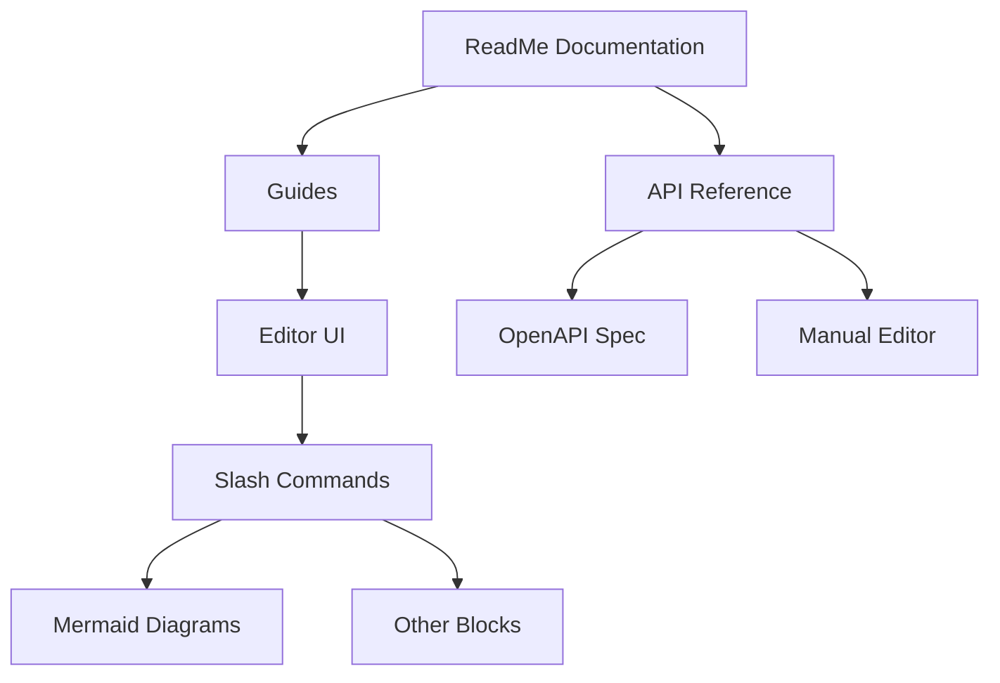

---
tags:
  - meeting
  - notes
  - demo
title: Meeting Notes — May 20, 2026
date: 2026-05-20
attendees:
  - Mohammed (PM)
  - Sara (Engineering Lead)
  - Liam (Design)
  - Priya (Growth)
---

# 📋 Meeting Notes — May 20, 2026

**Meeting:** NovaPay Q3 Launch Sync  
**Duration:** 45 min  
**Facilitator:** Mohammed

---

## Agenda

1. Timeline review
2. Beta partner status
3. Design refresh update
4. Engineering blockers

---

## Discussion Notes

### Timeline Review
Sara confirmed the core SDK is **on track for June 15 freeze**. The main risk is the payment processor contract — without test credentials, QA can't run full end-to-end scenarios. Mohammed to chase legal today.

### Beta Partner Status
Priya has 6 confirmed design partners out of the target 10:
- Acme Retail (e-commerce)
- Bolt Coffee (F&B)
- KidzLearn (edtech)
- MedBook (healthcare — HIPAA implications, legal reviewing)
- RideAlong (mobility)
- StyleHaven (fashion)

Still in conversation: 3 more prospects (NDA not signed). One dropped out (went with a competitor).

> [!note] Action Item
> Priya to send follow-up emails to the 3 prospects by **May 24**.

### Design Refresh Update
Liam presented 3 new color palette options. Team voted for **Palette B** (deep teal + warm white). Brand guidelines will be ready by June 5. Logo finalization needs one more round with the CEO.

> [!warning] Risk
> If logo isn't final by June 5, the docs site timeline slips. Sara flagged this as a hard dependency.

### Engineering Blockers
1. **P1 Bug — iOS crash on 3DS authentication:** Root cause found, fix in review, ETA May 25.
2. **React Native bridge performance:** ~200ms overhead on Android. Sara says acceptable for launch, will optimize in v1.1.
3. **Webhook retry logic:** Not implemented yet. Pushed to v1.1 per scope agreement.

---

## Decisions Made

| Decision | Owner |
|---|---|
| Biometric auth is opt-in at launch | Sara |
| Apple Pay deferred to v1.1 | Mohammed |
| Palette B selected for brand refresh | Liam |
| Webhook retries deferred to v1.1 | Mohammed |

---

## Action Items

- [x] Mohammed — Chase legal on processor contract by EOD May 20
- [x] Priya — Follow up with 3 prospects by May 24
- [x] Liam — Share brand guidelines draft by June 5
- [x] Sara — Confirm P1 iOS fix merged by May 25
- [x] Mohammed — Schedule CEO logo review before May 28

---

## Next Meeting

**Date:** June 3, 2026  
**Topic:** Beta launch readiness check

## Related

- [[Project Planning]]
- [[Research - Payment UX Trends]]