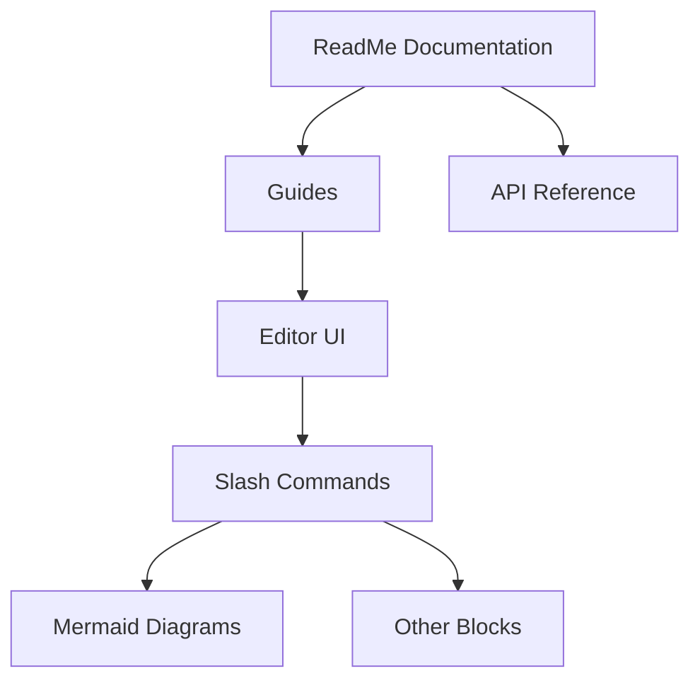

```mermaid
flowchart TB
    A["ReadMe Documentation"]
    B["Guides"]
    C["API Reference"]
    D["Editor UI"]
    G["Slash Commands"]
    H["Mermaid Diagrams"]
    I["Other Blocks"]
    A --> B
    A --> C
    B --> D
    D --> G
    G --> H
    G --> I
    %% mermaid-flow:pos A=330,60 B=61,174 C=870,188 D=249,408 G=518,376 H=307,860 I=736,661
```
